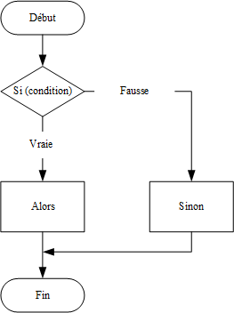
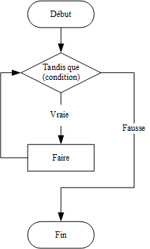
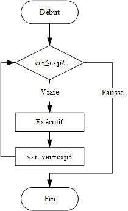
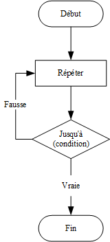

# Contrôle des flux

| Symbole d’instruction| Description|
|----------|----------|
| si...alors...sinon...fin| Directive de jugement conditionnel Si Jugez si la condition est vraie ou non de haut en bas, si un jugement est vrai, le bloc de code correspondant sera exécuté, et les jugements conditionnels suivants seront directement ignorés et ne seront plus exécutés.|
| Tandis que...faire...fin| L'instruction de contrôle de la boucle tandis que. Lorsque la condition est vraie, le programme exécute certaines instructions de manière répétée. Avant d'exécuter une instruction, la condition est vérifiée pour voir si elle est vraie.|
| pour...faire...fin| L'instruction de contrôle de la boucle pour répète l'instruction spécifiée, et le nombre de répétitions peut être contrôlé dans l'instruction pour.|
| Répéter...jusqu’à ()| L'instruction de contrôle de boucle répéter. Répéter la boucle jusqu'à ce que la condition spécifiée soit vraie.|

### Instruction de jugement conditionnel Si

Le résultat de l'expression peut être n'importe quelle valeur ; Lua considère false et nil comme faux, mais tout le reste est vrai, et le nombre 0 est également vrai. Si l'expression est vraie, le bloc then est exécuté ; si l'expression est fausse, le bloc else est exécuté s'il y en a un, sinon l'instruction après end est exécutée directement.



Les instructions si peuvent être imbriquées, comme le montre l'exemple ci-dessous.
```lua
a = 100;
b = 200;
--[Condition de vérification--]
if(a == 100)
then
	--[Exécuter l'instruction suivante si la condition si est vraie--]
	if(b == 200)
	then
        --[Exécuter ce bloc d'instructions si la condition si est vraie--]
        print("la valeur de a est : ", a ) -- Valeur de a : 100
		print("la valeur de a est : ", b ) -- Valeur de b : 200
	end
else
    --[Exécuter ce bloc d’instructions si la première condition si est fausse--]
    print("a n’est pas égal à 100")
end
```

### Instruction de contrôle de la boucle tandis que

La condition à l'intérieur des parenthèses après while est l'expression de la condition ; si elle est vraie, le bloc d'instructions do est exécuté, puis la condition est réévaluée ; si elle est fausse, l'instruction après end est exécutée directement.



Exemple :

```lua
a=10
while( a < 20 )
do
	print("la valeur de a est :", a) -- Exécuté 10 fois, les valeurs de sortie vont de 10 à 19
	a = a+1
end
```

### Instructions de contrôle de la boucle pour

La syntaxe de la boucle for est la suivante :

```lua
for var=exp1,exp2,exp3 do  
    <Exécutif>  
end  
```

La valeur initiale de la variable var est exp1, après chaque exécution de \<corps d'exécution>, var est incrémentée de exp3 (la valeur de exp3 peut être négative ou non spécifiée, la valeur par défaut est 1), jusqu'à ce que var soit supérieure à exp2.



Exemple :

```lua
for i=10,1,-1 do
    print(i) -- Exécuté 10 fois, les valeurs de sortie vont de 10 à 1
end
```

### Instruction de contrôle de la boucle répétitive

La boucle repeat est similaire à la boucle while, la principale différence étant que while évalue la condition avant d'exécuter l'instruction à boucler, et boucle lorsque la condition est vraie ; repeat évalue la condition après avoir exécuté l'instruction à boucler, et boucle lorsque la condition est fausse.



Exemple :

```lua
a = 10
repeat
	print("la valeur de a est :", a) -- Exécuté 5 fois, les valeurs de sortie vont de 10 à 15
	a = a + 1
until(a > 15)
```