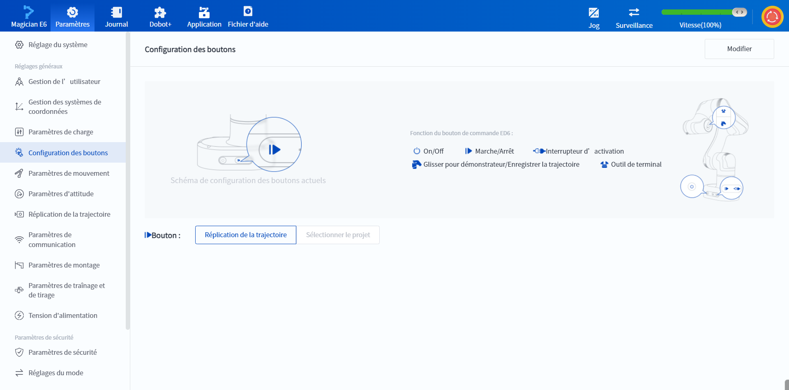

# 10.5 Configuration des boutons (Magician E6)

Lorsque le type de bras est Magician E6, vous pouvez régler la fonction du bouton Marche/Arrêt de la base.

 

La fonction du bouton Marche/Arrêt peut être modifiée en cliquant sur le bouton **Modifier** dans le coin supérieur droit.

- La fonction par défaut de ce bouton est Réplication de la trajectoire, qui reproduit la dernière trajectoire enregistrée ;

- Paramètres des fonctionsSi la fonction est réglée sur Exécuter le projet, vous devez sélectionner le projet à exécuter.
  
  

 

Quelle que soit la fonction du bouton, le fait d'appuyer sur le bouton pendant la reproduction de la trajectoire du bras du robot ou pendant l'exécution d'un projet interrompt l'opération.