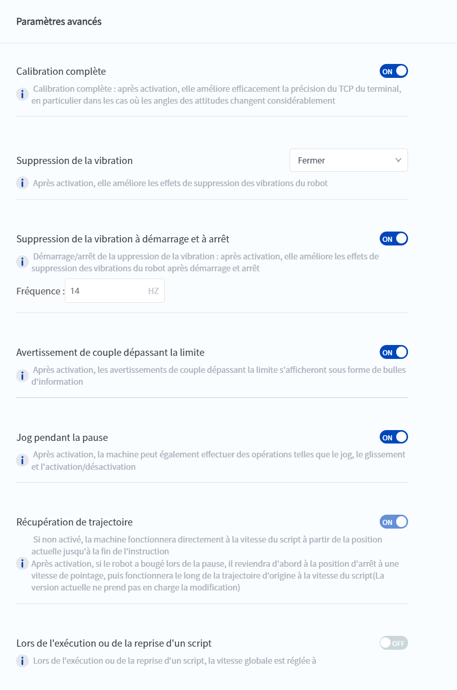

# 10.16 Fonctions avancées

Lorsque des fonctions avancées doivent être activées ou désactivées en raison des conditions du site, elles peuvent être configurées dans cette interface. Veuillez vous référer aux invites de l'interface pour la description de chaque fonction, et il est recommandé de conserver la valeur par défaut s'il n'y a pas de besoin particulier.

 

 

<b> Description : </b>
<b>Activer la fonction de maintien de jog pendant la pause</b> und <b>Réinitialiser le trajectoire. </b>Pour plus de détails, veuillez consulter<a href="..\programming\track.md"><b>Réinitialiser le trajectoire</b></a>. </li>

