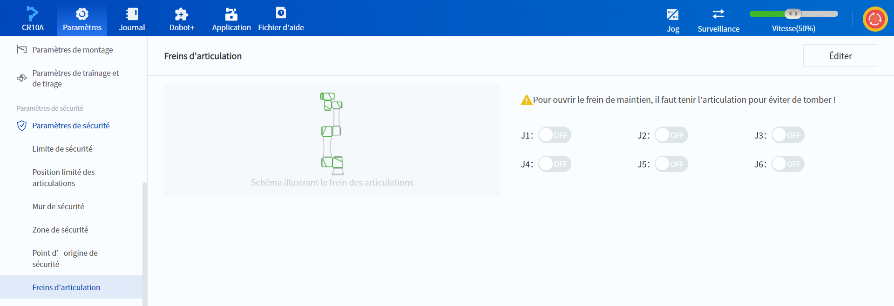

# 10.13.7 Freins d'articulation

Lorsque le robot est dans l'état activé vers le bas, pour empêcher le mouvement des articulations, les articulations sont automatiquement verrouillées pour maintenir les moteurs en position, garantissant que les pièces mobiles de la machine ne se déplacent pas en raison du poids propre ou des forces externes. En cas d'urgence, l'utilisateur peut relâcher les poignées des articulations via cette page et faire glisser les articulations correspondantes pour les déplacer.

 

 
 

Si vous souhaitez faire glisser et déposer une articulation, vous pouvez activer le portail en maintenant manuellement l'articulation après l'activation du robot, en activant l'interrupteur de l'articulation que vous souhaitez déplacer, puis en cliquant sur **Enregistrer**.

<b> Avertissement : </b>
Lorsque le frein est activé, il est nécessaire de maintenir manuellement les articulations pour éviter que le bras robotique ne tombe à cause de son poids propre. 

