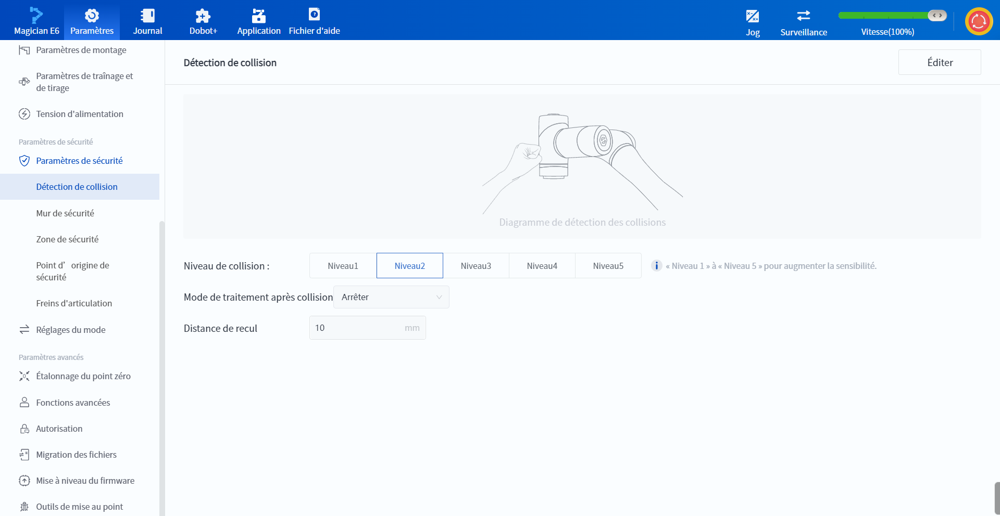

# 10.13.1 Détection de collision (Magician E6)

Lorsque le robot détecte une collision pendant son déplacement, il s'arrête automatiquement. Les utilisateurs peuvent définir la sensibilité de la détection de collision et la méthode de traitement spécifique après la collision.

<b> Description : </b>
Si vous devez activer ou désactiver la détection de collisions, veuillez contacter le support technique. 

 

 

 

Plus le niveau de collision est élevé, plus la force requise pour déclencher la détection de collision est faible.

- Le niveau 5 est uniquement utilisé pour les opérations à faible vitesse, et le robot peut déclencher la détection de collision par erreur lorsqu'il fonctionne à grande vitesse et à forte accélération avec une charge sous ce niveau de collision. 
- Lorsque le robot est entièrement chargé, réglez le niveau de collision sur le niveau 3 ou inférieur. 

Le robot gère les collisions différemment selon qu'il s'agit d'une opération de pointage ou d'une opération automatique.

**Lorsqu'une collision se produit pendant le pointage**

Une fenêtre contextuelle du logiciel indique qu'une collision a été détectée. Vous devez alors résoudre la cause de la collision et cliquer sur **Réinitialisation**. Si vous devez utiliser le logiciel de contrôle pour résoudre la cause de la collision, cliquez sur **Rappelez-moi dans une minute** pour fermer temporairement la fenêtre contextuelle (la fenêtre contextuelle sera à nouveau affichée après une minute).

 

**Collision pendant le fonctionnement automatique**

Le robot gère la collision en fonction de la **méthode de gestion post-collision** :

- **Arrêt** : le robot s'arrête de fonctionner. 

- **Pause** : le robot fait une pause. Vous devez choisir de continuer après avoir résolu la cause de la collision ou de vous arrêter en fonction de la situation réelle. Lorsque le robot est en pause dans une collision, il peut être repris en appuyant sur le bouton d'apprentissage par glisser-déposer situé à l'extrémité du robot.

 

Quelle que soit la méthode de traitement, le robot recule automatiquement de la distance spécifiée en fonction de la trajectoire avant la collision. La plage de réglage de la distance de recul est comprise entre 0 et 50 mm, et la valeur par défaut est de 10 mm.
