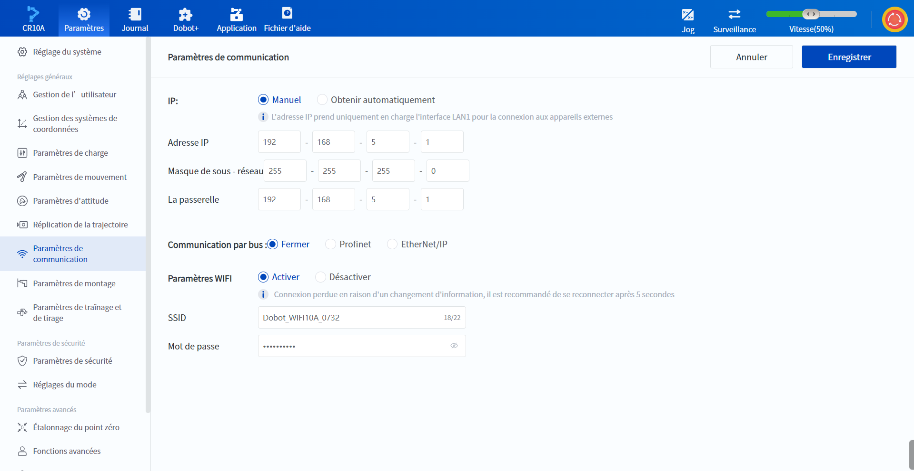

# 10.9 Paramètres de communication

Les **Paramètres de communication** sont principalement utilisés pour définir les paramètres de communication liés à l'interface du contrôleur actuellement connecté, tels que l'adresse IP du contrôleur LAN1, le mode de bus et les propriétés liées au WiFi.

### IP

Le robot peut communiquer avec des périphériques externes via l'interface LAN, en prenant en charge les protocoles TCP, UDP ou Modbus. L'utilisateur peut modifier l'adresse IP, le masque de sous-réseau et la passerelle de l'interface réseau LAN1 du robot. Lors de la connexion à un dispositif externe, l'adresse IP doit se trouver dans le même segment de réseau que l'adresse IP du dispositif externe et ne pas être en conflit.

- Si le robot est connecté directement au périphérique externe ou via un commutateur, sélectionnez **Manuel** pour modifier l'adresse IP, le masque de sous-réseau (requis lors de la connexion à un réseau combiné à plusieurs segments) et la passerelle par défaut afin que le robot se trouve sur le même segment de réseau que le périphérique externe. 
- Si le robot et les périphériques externes sont connectés via un routeur, sélectionnez **Obtenir automatiquement** (l'adresse IP est automatiquement attribuée par le routeur).

### Communication par bus

Le réglage de la fonction de communication par bus prend en charge le réglage sur **Fermer**, **Profinet** ou **EtherNet/IP**.

Lorsque vous choisissez **Profinet** ou **EtherNet/IP**, vous devez définir l'action du robot en cas de perte de communication avec le bus :

- **Maintenir l'exécution** : continue d'exécuter le projet sans aucun traitement lorsque la communication par bus est perdue. 
- **Suspendre** : suspend le projet en cours lorsque la communication par bus est perdue. 
- **Arrêter** : le projet en cours est arrêté lorsque la communication bus est perdue. 

Veuillez vous référer à la documentation du protocole de communication de bus Dobot (EtherNet/IP, Profinet) pour l'utilisation de la fonction de communication de bus.

<b> Attention : </b>
Après avoir configuré la communication par bus en Profinet, le port LAN1 du robot ne peut plus être utilisé que pour la communication Profinet et il n’est pas possible de lui attribuer d’adresse IP. Si vous souhaitez utiliser le LAN1 pour une autre communication, veuillez modifier à nouveau et sauvegarder les paramètres de communication par bus, puis redémarrer l’armoire de commande. 

 

### Paramètres WiFi

Le robot peut communiquer avec des dispositifs externes via WiFi. L'utilisateur peut activer ou désactiver le WiFi, ainsi que modifier le nom et le mot de passe du WiFi. Cliquez sur  pour afficher le mot de passe actuel.

Le module WiFi du Magician E6 doit être acheté et installé par l'utilisateur, et il n'est pas possible de l'activer ou de le désactiver sur cette page.

<b> Attention : </b>
La modification des paramètres WiFi peut entraîner la déconnexion du logiciel avec le robot. Veuillez essayer de se reconnecter après 5 secondes. 

