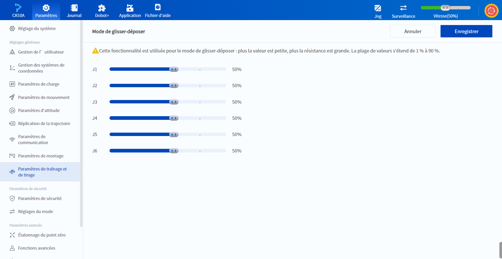

# 10.11 Paramètres de traînage et de tirage

Le paramètre de traînée est principalement utilisé pour régler la sensibilité des articulations du robot pendant l'opération de traînée. Plus la sensibilité est faible, plus la résistance est élevée pendant l'opération de traînage. La plage de valeurs s'étend de 1 % à 90 %.

 

 
  
 

<b> Description : </b>
<ul><li>Le réglage de la sensibilité n’est efficace que lorsque le déplacement des articulations n’a pas atteint la vitesse limite. Une fois cette vitesse atteinte, une résistance inverse sera générée pour éviter tout dépassement de vitesse. </li><li>Les valeurs de vitesse limite varient selon les modèles de bras robotique. Les vitesses limites pour J1 à J3 sont d’environ 30 à 40°/s, tandis que pour J4 à J6, elles sont d’environ 90 à 100°/s. </li></ul>

