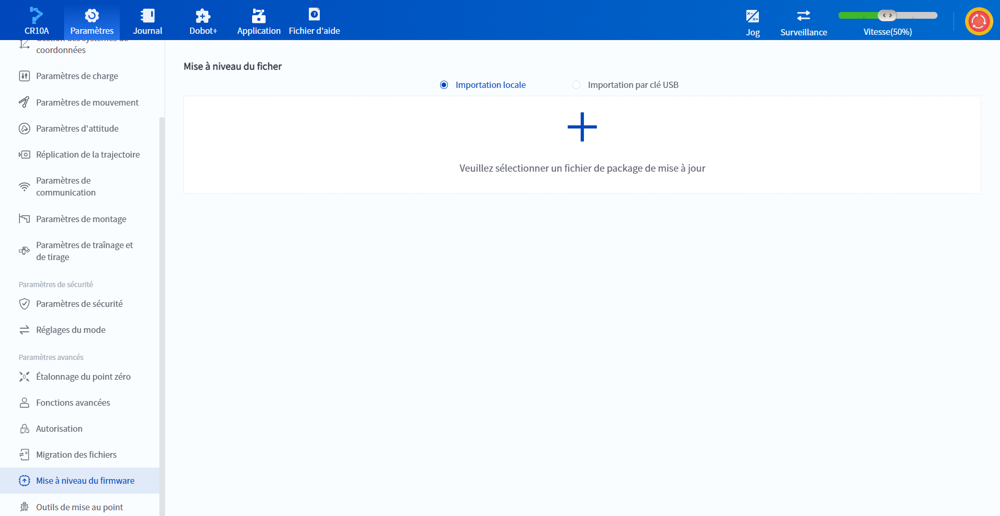
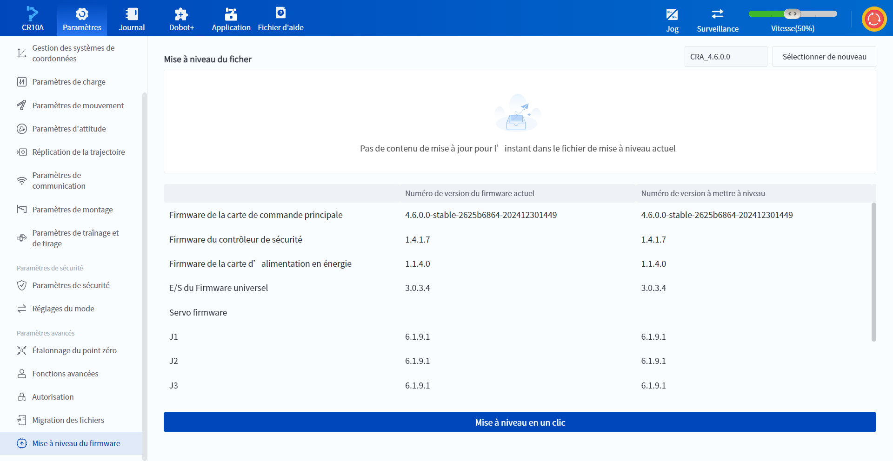
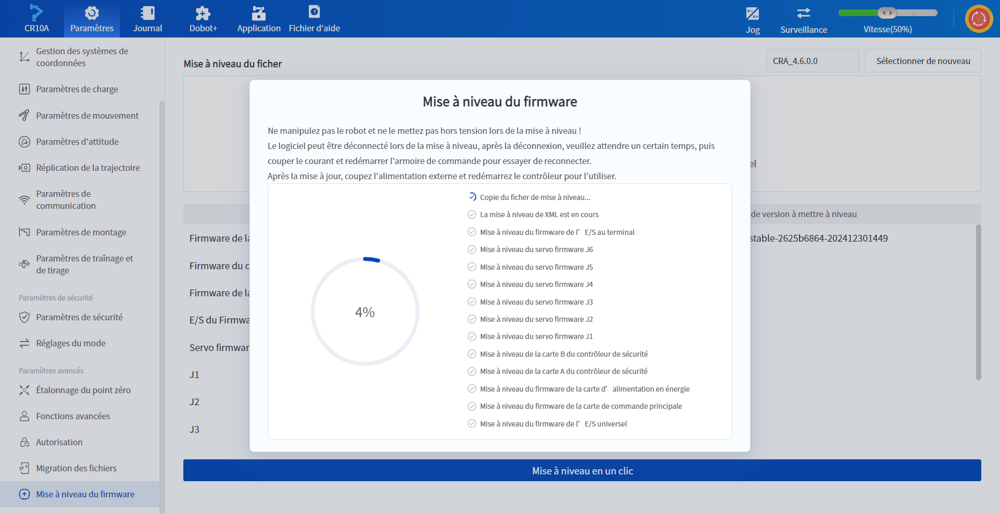
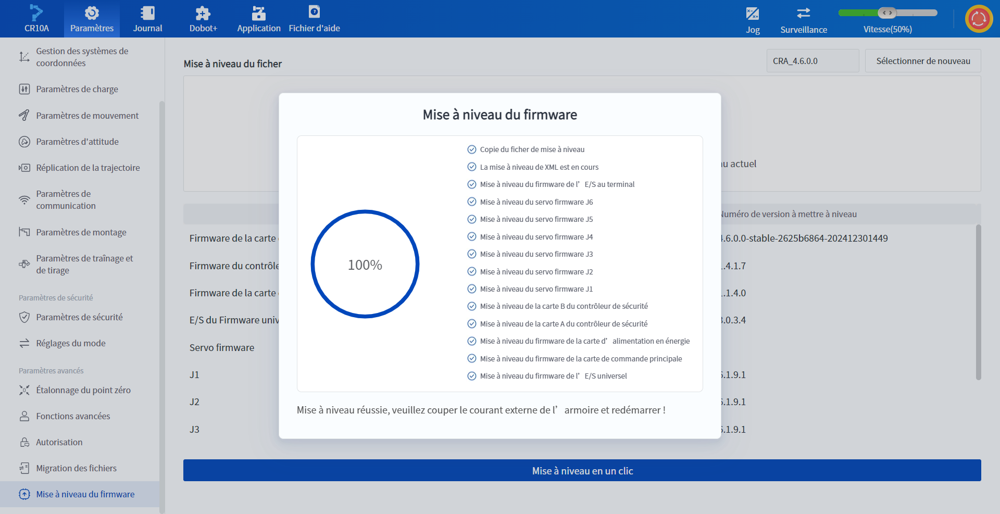

# 10.18 Mise à niveau du firmware

La page **Mise à niveau du firmware** vous permet de mettre à niveau le micrologiciel du robot vers la dernière version ou de revenir en arrière en un seul clic.

 

Cliquez sur **Paramètres** > **Mise à niveau du firmware** pour importer le fichier de mise à niveau enregistré localement ou sur une clé USB dans le système via **l'importation locale** ou **l'importation par clé USB**.

<b> Description : </b>

<ul><li>Lors de l’importation d’un package de mise à jour, il est nécessaire de désactiver d’abord le bras robotique avant de pouvoir continuer les opérations ; il est interdit de déconnecter le bras robotique pendant le processus de mise à jour. </li>
   <li>Lors de l’utilisation de <b>l’importation par clé USB</b> pour une mise à nouveau du firmware, il est recommandé d’insérer la clé USB dans un dock USB sans interface réseau. </li> <li>Lors de l’importation par clé USB, seuls les fichiers compressés dans le répertoire racine de la clé USB seront affichés. Veuillez sélectionner le fichier correct. </li>
   <li>Seul un utilisateur avec des droits d’administrateur peut utiliser <b>la mise à nouveau du firmware</b>, et ces droits ne peuvent pas être configurés.</li>
</ul>

 

Après avoir importé le fichier de mise à niveau, extrayez le fichier localement, et les informations sur l'ancienne et la nouvelle version du micrologiciel ainsi que le contenu de la mise à niveau s'afficheront une fois l'extraction réussie.

 

Cliquez sur **Mise à niveau en un clic** pour démarrer la mise à niveau, l'interface affiche la progression de la mise à niveau, à ce moment-là, toutes les autres fonctions ne peuvent pas être utilisées.

 

- Si le message "Failed to copy upgrade file" (Échec de la copie du fichier de mise à niveau) s'affiche pendant le processus de mise à niveau, vous pouvez cliquer sur **Remise à niveau** pour réessayer la mise à niveau. 
- Si vous obtenez un message d'erreur autre que "Échec de la copie du fichier de mise à niveau" pendant le processus de mise à niveau, vous pouvez résoudre le problème en fonction du message d'erreur renvoyé par l'interface. 
- Une fois la mise à niveau terminée et le message indiquant que la mise à niveau a réussi, vous devez appuyer sur l'interrupteur du bateau pour éteindre et redémarrer l'armoire de commande ; après le redémarrage de l'armoire de commande, reconnectez le robot avec DobotStudio Pro.

 

<b> Description:</b>

Il est préférable d’utiliser l’outil de maintenance du robot pour effectuer la mise à nouveau de la version du firmware. 

