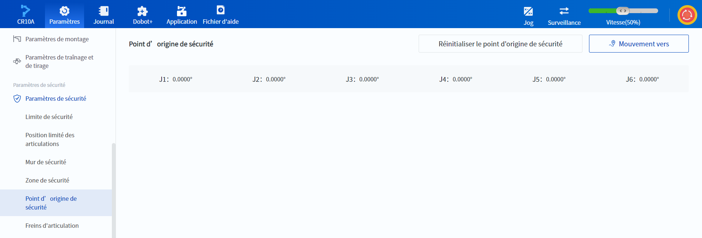
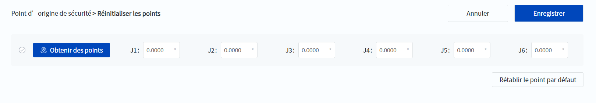

# 10.13.6 Point d'origine de sécurité

La position d'origine sûre est une position personnalisable et sa position par défaut est une position de point zéro, c'est-à-dire que tous les angles des articulations sont à 0. Il est recommandé que l'utilisateur modifie la position en fonction de l'application sur le terrain. Lorsque le robot est en position de sécurité, un signal d'état de position de sécurité peut être émis via les [E/S de sécurité](..\monitoring\io_monitor_safe_io.md), les [E/S système](..\monitoring\io_monitor_ctrl_dio.md) ou le [Modbus](..\monitoring\modbus.md), et l'utilisateur peut se baser sur le signal pour réaliser la logique selon laquelle le robot ne peut exécuter le projet que lorsqu'il est en position de sécurité.

 

- Appuyez sur  **Mouvement vers**et maintenez-le enfoncé pour déplacer  le bras du robot vers la position de sécurité .
- Cliquez sur **Réinitialiser le point d'origine de sécurité** pour modifier le point de sécurité.

Vous pouvez saisir manuellement les angles des articulations ou cliquer sur  **Obtenir des points** après avoir contrôlé le robot à une attitude spécifiée pour lire les angles actuels des articulations. Cliquez sur **Rétablir le point par défaut** pour rétablir la position d'origine sûre par défaut.

Après avoir déterminé les angles de chaque articulation, cliquez sur **Enregistrer** pour mettre à jour la position d'origine de sécurité.

