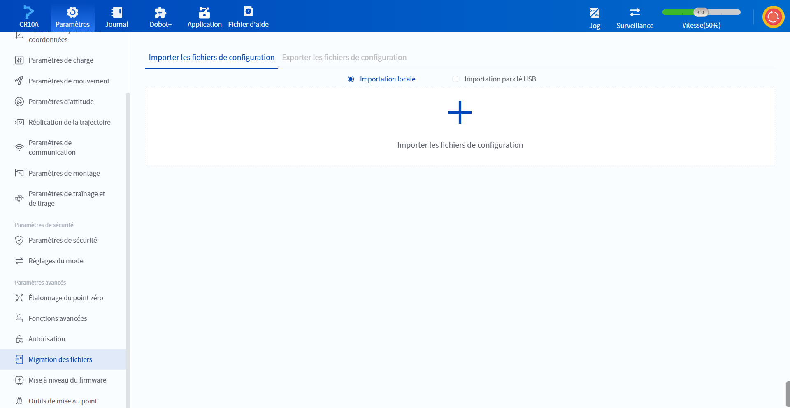
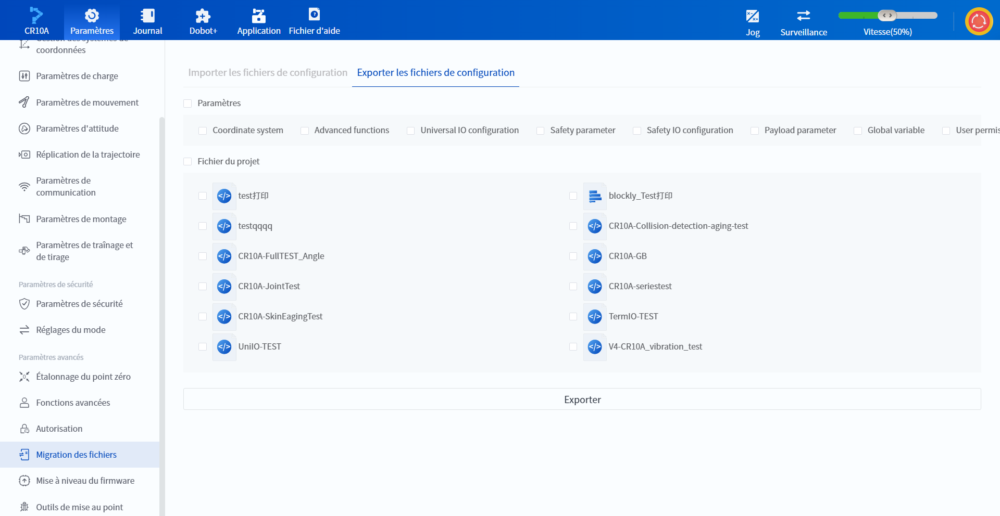
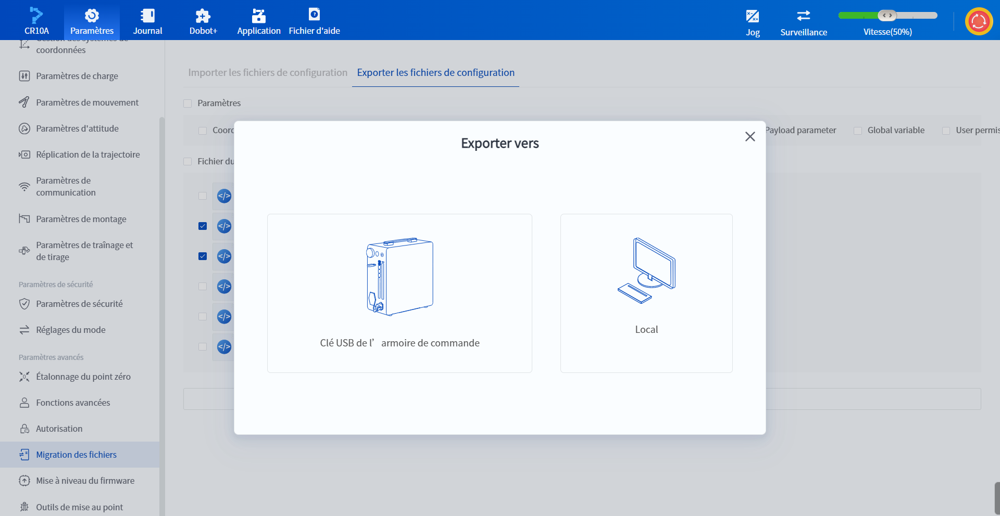

# 10.17 Migration des fichiers

DobotStudio Pro prend en charge les fonctions d'importation et d'exportation des fichiers internes du robot (par exemple, les fichiers de programme, les fichiers de configuration, etc.) Cette fonction peut être utilisée pour la sauvegarde du système, la copie de périphériques et d'autres scénarios, et prend en charge l'importation et l'exportation via une clé locale ou USB.

### Importer les fichiers de configuration

 

Cliquez sur **Paramètres** > **Migration des fichiers** pour accéder à la page **Importer les fichiers de configuration**, et vous pouvez importer des fichiers de configuration enregistrés localement ou sur une clé USB dans le système via l'**Importation locale** ou l'**Importation par clé USB**.

<b> Description : </b>

<ul><li>Lors de l’importation d’un fichiers de configuration, il est nécessaire de désactiver d’abord le bras robotique avant de pouvoir continuer les opérations. </li>
    <li>Lors de l’importation par clé USB, seuls les fichiers compressés dans le répertoire racine de la clé USB seront affichés. Veuillez sélectionner le fichier correct. </li>
</ul>

### Exporter les fichiers de configuration

 

Cliquez sur l'onglet **Exporter les fichiers de configuration**, cochez les paramètres et les fichiers de projet à exporter, cliquez sur le bouton **Exporter** et la fenêtre **Exporter vers** s'affiche.

 

Sélectionnez l'exportation du fichier de configuration du système vers la **Clé USB de l'armoire de commande** ou **Local**.

<b> Description : </b>

<ul><li>Si vous choisissez d’exporter vers <b>la clé USB de l’armoire de commande</b>, l’exportation se fera par défaut dans le répertoire racine de la clé USB. </li><li>Lors de l’utilisation de la clé USB de l’armoire de commande pour l’importation et l’exportation, l’utilisateur peut insérer la clé USB dans l’un des ports USB de l’armoire de commande ; si les deux ports USB sont occupés par des clés USB, le système utilisera par défaut le premier fichier de dossier accessible.</li>
    <li>Le nombre de projets pouvant être exportés est limité à 100. </li>
</ul>

