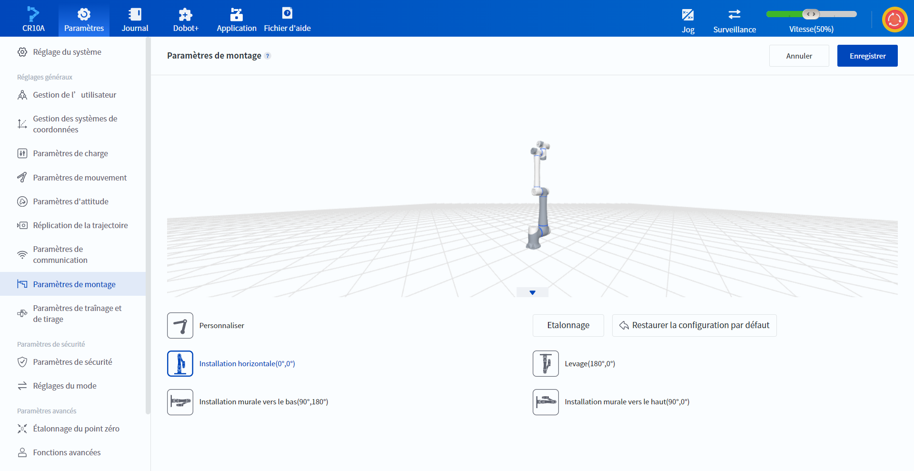

# 10.10 Paramètres de montage

En général, le bras est installé sur un comptoir ou un sol lisse, auquel cas il n'est pas nécessaire d'effectuer une quelconque opération sur cette page. Si le bras est monté au plafond, au mur ou à un angle, les angles de rotation et d'inclinaison doivent être définis dans l'état d'activation inférieur.

L'objectif principal des paramètres de montage est d'informer le robot de la direction correcte de la gravité et de permettre au modèle 3D d'être affiché à l'angle correct dans le logiciel.

<b> Attention : </b>
Une configuration d’installation incorrecte peut entraîner des alertes d’anomalies de détection de collision ou le fait que le corps du robot ne soit pas contrôlé pendant le déplacement. 

 

 

 

Les utilisateurs peuvent procéder à un étalonnage manuel ou automatique.

### Étalonnage manuel

En fonction de la position de montage actuelle, sélectionnez la position de montage correspondante sur le côté gauche de la page, ou ajustez l'angle d'inclinaison et l'angle de rotation au bas de la page après avoir sélectionné **Personnaliser**. Une description détaillée de chaque position peut être consultée en cliquant  sur le côté droit du titre de la page.

- L'**angle d'inclinaison** fait référence à l'angle auquel le corps tourne dans le sens inverse des aiguilles d'une montre autour de l'axe X à l'origine.

- L'**angle de rotation** fait référence à l'angle auquel le corps tourne dans le sens inverse des aiguilles d'une montre autour de l'axe Z à la position d'origine.

### Étalonnage automatique

Une fois le bras monté et activé, cliquez sur **Etalonnage** et suivez les instructions de la boîte de dialogue pour obtenir l'angle d'inclinaison et l'angle de rotation.

 

 

Cliquez sur **Restaurer la configuration par défaut** pour rétablir les valeurs par défaut des angles calibrés.

Après avoir défini l'angle de montage, essayez d'entrer en mode de déplacement en appuyant sur le bouton situé à l'extrémité du bras du robot afin de vérifier si la fonction de déplacement est normale. En cas d'anomalie, réinitialisez l'angle de montage ou contactez l'assistance technique.