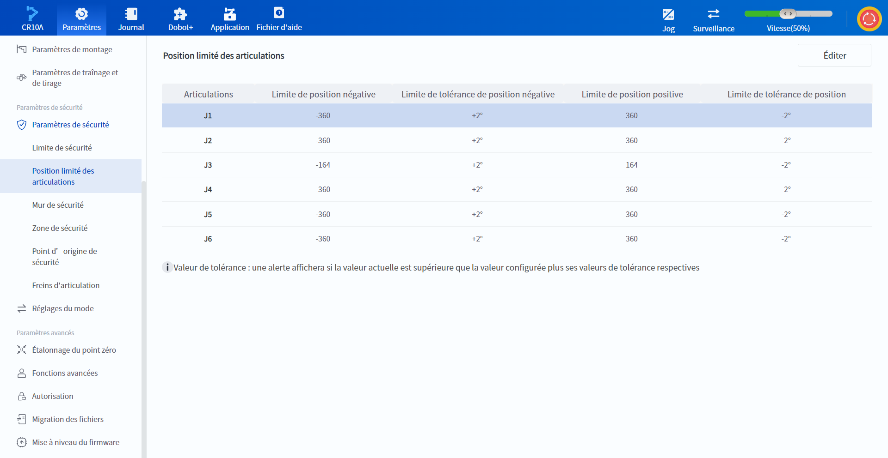

# 10.13.3 Position limité des articulations (série CRA)

L'utilisateur peut définir des limites souples pour chaque articulation du robot afin de limiter l'amplitude du mouvement de chaque articulation du robot.

 

Lorsque l'angle d'articulation réel du robot est inférieur à (Limite de position négative + Limite de tolérance de position négative) ou supérieur à (Limite de position positive + Limite de tolérance de position), une alarme se déclenche et le mouvement s'arrête.

Parmi ces paramètres, les valeurs de la limite négative et de la limite positive peuvent être modifiées.

Cliquez sur **Éditer** pour modifier les paramètres, cliquez sur **Enregistrer** pour enregistrer les valeurs modifiées après modification, cliquez sur **Annuler** pour annuler cette modification et cliquez sur **Restaurer les valeurs par défaut** pour rétablir les valeurs par défaut des paramètres.