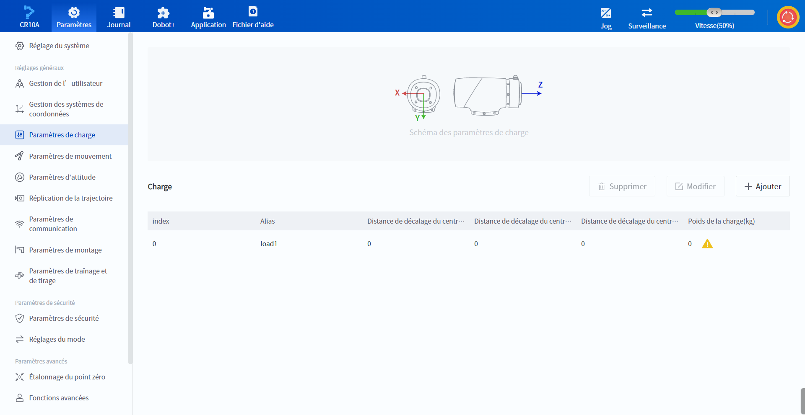
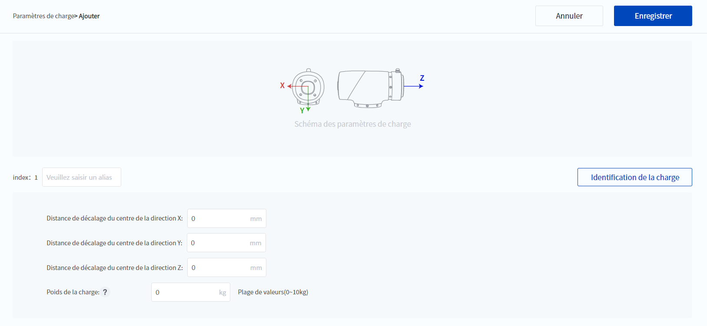
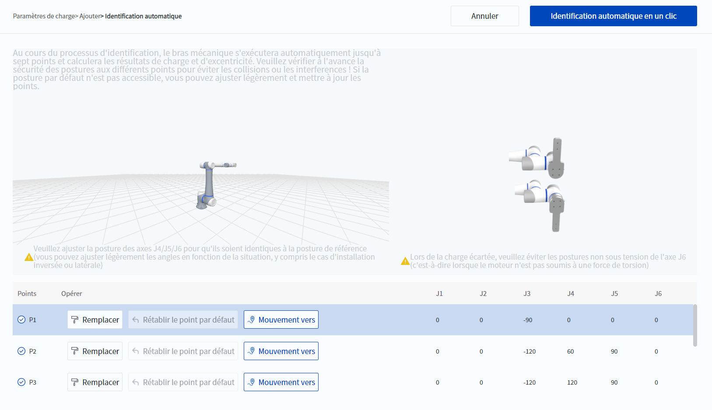

# 10.4 Paramètres de charge

Les paramètres de charge sont le centre de masse et le poids de la charge finale du robot (y compris les fixations), veuillez les définir en fonction de la charge réelle.

<b> Description : </b>
Cette interface est uniquement destinée à modifier les paramètres du groupe de charge. Les modifications ne prendront effet immédiatement. Si vous souhaitez que les paramètres modifiés prennent effet, veuillez sélectionner le groupe de paramètres correspondant dans la page de configuration de la charge qui s’affiche lors de l’activation du robot. 

 

<b> Attention : </b>
Si la configuration de la charge n’est pas correcte, cela peut entraîner une diminution des performances du robot et peut provoquer des alertes d’anomalies de détection de collision ou le fait que le corps du robot ne soit pas contrôlé pendant le déplacement. 

 

 

Cliquez sur  **Ajouter** pour ajouter un nouveau jeu de paramètres de charge ; cliquez pour sélectionner un groupe de paramètres, cliquez sur  **Modifier** pour modifier le groupe de paramètres sélectionné et cliquez sur  **Supprimer** pour supprimer le groupe de paramètres sélectionné.

### Ajout/modification d'un groupe de paramètres

 

L'alias du groupe de paramètres peut être modifié, et l'alias du groupe de paramètres sera utilisé pour faire référence au groupe de paramètres lors de l'activation et de la programmation.

Il existe deux façons de définir les paramètres de charge : l’Identification de la charge et la modification manuelle.

**Identification de la charge**

Lorsque le robot est activé, qu'il n'a pas d'alarmes et qu'il n'est pas en mouvement, les paramètres de la charge actuelle sont automatiquement reconnus.

<b> Description : </b>
<ul>
    <li>Avant de procéder à l’identification de la charge, veuillez vous assurer que l’<a href="installation.md">angle d’installation</a> est correctement configuré. </li>
    <li>Le Magician E6 ne prend pas en charge la fonction d’identification de la charge. </li>
    </ul>

 

1. Cliquez sur **Identification de la charge** pour ouvrir la fenêtre Reconnaissance automatique.
2. Le système génère automatiquement 7 points par défaut, sélectionnez un point pour afficher le diagramme de position correspondant et appuyez sur  <b>Mouvement vers</b> et maintenez-le enfoncé pour déplacer le robot vers le point correspondant.
3. Si le robot ne peut pas se déplacer vers un point par défaut en raison d'un obstacle, vous pouvez vous référer au schéma du point pour déplacer le robot vers un autre point qui remplit les conditions, puis  <b>Remplacer</b> le point par défaut. Cliquez sur  <b>Rétablir le point par défaut</b> pour rétablir les points remplacés sur les points par défaut.
4. Cliquez sur **Identification automatique en un clic** et confirmer, le bras du robot se rendra à chaque point à tour de rôle et l'identifiera.
   - Si l'identification est réussie, le logiciel revient à l'interface d'ajout/modification de charge et les paramètres de charge sont mis à jour en fonction des paramètres dérivés de l'identification. Veuillez vérifier si ces paramètres sont raisonnables par rapport à la situation réelle de la charge. Si ce n'est pas le cas, répétez l'identification de la charge ou modifiez les paramètres manuellement.
   - Si l'identification échoue, un message d'erreur s'affiche et la page d'identification automatique reste affichée. Veuillez consulter le schéma de chaque point pour vérifier si le point répond aux exigences, et modifiez le point qui ne répond pas aux exigences, puis **Identification automatique en un clic** à nouveau.

 

**Modification manuelle**

Remplissez manuellement les paramètres de charge suivants :

- **Distance de décalage du centre dans la direction X/Y/Z** : distance de décalage du centre de masse de la charge d'extrémité dans chaque direction, voir le diagramme sur l'interface pour la direction de chaque axe. 
- **Poids de la charge** : la somme du poids de l'embout et du poids de la pièce à usiner, qui ne peut pas dépasser la charge maximale autorisée par le robot. 

Après avoir modifié les paramètres, cliquez sur le bouton **Enregistrer** pour enregistrer les paramètres.