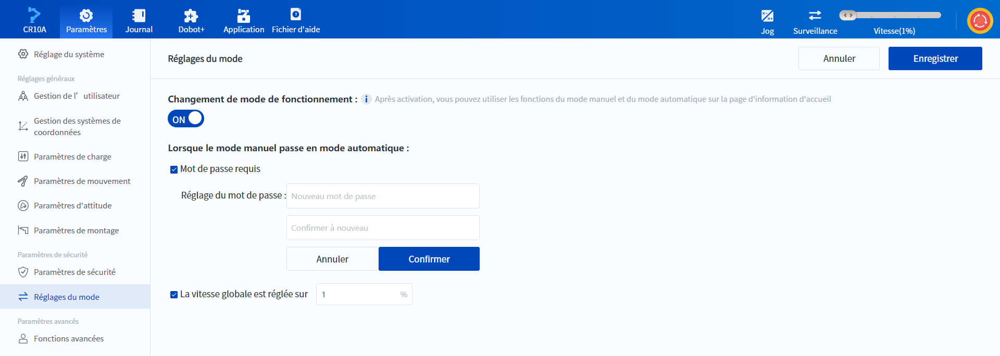

# 10.14 Réglages du mode

La fonction de commutation du mode manuel/automatique du robot est désactivée par défaut (le CR20 est en mode manuel par défaut) et peut être activée sur cette page. Le mode manuel/automatique est principalement utilisé pour améliorer la sécurité des applications sur le terrain, veuillez choisir si vous avez besoin de l'activer en fonction des résultats de l'évaluation des risques.

 

Activer la fonction du **Changement de mode de fonctionnement**, le **Mot de passe requis** est disponible pour passer du mode manuel au mode automatique. Si cette option est cochée, un mot de passe est requis (pas de mot de passe initial).

Si la fonction de **La vitesse globale est réglée sur** est cochée, la vitesse globale sera automatiquement ajustée à la valeur définie lors du passage en mode Auto. **La vitesse globale est réglée sur** ne peut être saisi que sous la forme d'une valeur entière comprise entre 1 et 100.