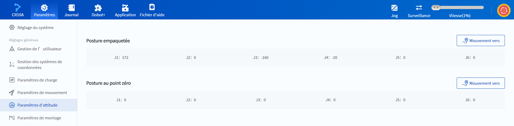

# 10.7 Paramètres d'attitude

Cette page permet de déplacer le robot dans différentes positions prédéfinies en usine.

 

- **Posture empaquetée** réduit l'encombrement du robot et facilite l'emballage et l'expédition.
- L'angle de toutes les articulations dans la **Posture au point zéro** est de 0 degré.

Appuyez sur  **Mouvement vers** et maintenez-le enfoncé pour déplacer le robot vers la pose correspondante.

<b> Description : </b>
Vous pouvez également déplacer le robot dans cette posture via l’interface <a href="../operation/jog_oper.md">Jog</a>. 

