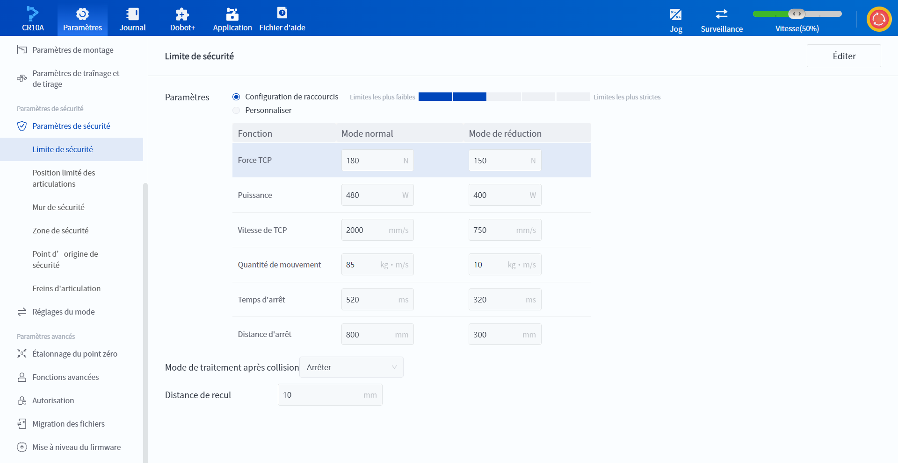
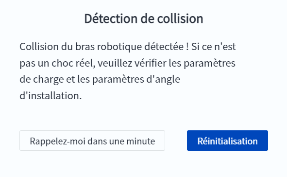

# 10.13.2 Limites de sécurité (série CRA)

Afin de garantir la sécurité du robot et de l'utilisateur, le système robotique limite les paramètres pertinents lorsque le robot se déplace, et l'utilisateur peut définir les valeurs limites en fonction de ses besoins.

 

**Paramètres**

Configuration de raccourcis et Personnaliser sont tous deux pris en charge.

- **Configuration de raccourcis** : sélectionnez l'un des 5 niveaux prédéfinis (ci-après dénommés niveau 1 pour la restriction la plus souple, niveau 5 pour la restriction la plus stricte, etc.)
  
  
<b> Description : </b>
<ul>
  <li>Le niveau 5 est uniquement utilisé pour les opérations à faible vitesse, et le robot peut déclencher la détection de collision par erreur lorsqu'il fonctionne à grande vitesse/forte accélération avec une charge sous ce niveau de collision. </li>
  <li>Lorsque le robot est entièrement chargé, réglez le niveau de collision sur le niveau 3 ou inférieur. </li>
  <li>Les niveaux prédéfinis ne sont que des valeurs recommandées et ne remplacent pas une évaluation correcte des risques. </li>
  </ul>
  

 

- **Personnaliser** : saisissez vous-même les valeurs de chacun des paramètres de limitation. Le fait de revenir à la configuration de raccourcis réinitialise les paramètres aux valeurs prédéfinies pour le niveau correspondant.

La signification de chaque paramètre de limitation est la suivante (tous les paramètres nécessitent des valeurs limites distinctes pour les modes normal et réduit) :

- **Force TCP** : Limite la force maximale au point central de l'outil d'extrémité du robot (TCP). 
- **Puissance** : Limite la puissance totale maximale du robot. 
- **Vitesse de TCP** : Limite la vitesse maximale du TCP lorsque le robot est en marche. 
- **Quantité de mouvement** : Limite la valeur maximale du momentum global du robot lorsque le robot est en marche. 
- **Temps d'arrêt** : Limite le temps maximum requis pour arrêter le robot en cas de déclenchement d'alarme (y compris les arrêts d'urgence). 
- **Distance d'arrêt** : Limite la distance maximale requise pour arrêter le robot en cas de déclenchement d'une alarme (y compris les arrêts d'urgence). 

Lorsque le robot planifie son déplacement, il ajuste la vitesse maximale planifiée en fonction de la situation réelle de manière à ce que les valeurs des paramètres ci-dessus dans le plan soient comprises dans les limites. Dans ces conditions, si la **force TCP** ou la **puissance** dépasse la valeur limite lorsque le robot se déplace, cela sera considéré comme une collision, et le robot s'arrêtera automatiquement et déclenchera une alarme de détection de collision.

<b> Description : </b>
<ul>La vitesse de TCP, la quantité de mouvement, le temps d’arrêt et la distance d’arrêt limitent ensemble la vitesse de TCP maximale du robot. Plus le paramètre est grand, plus la vitesse de mouvement du robot est élevée.
    </ul>

 

Le robot gère les collisions différemment selon qu'il s'agit d'une opération de pointage ou d'une opération automatique.

**Lorsqu'une collision se produit pendant le pointage**

Une fenêtre contextuelle du logiciel indique qu'une collision a été détectée. Vous devez alors résoudre la cause de la collision et cliquer sur **Réinitialisation**. Si vous devez utiliser le logiciel de contrôle pour résoudre la cause de la collision, cliquez sur **Rappelez-moi dans une minute** pour fermer temporairement la fenêtre contextuelle (la fenêtre contextuelle sera à nouveau affichée après une minute).

 

**Collision pendant le fonctionnement automatique**

Le robot gère la collision en fonction de la **méthode de gestion post-collision** :

- **Arrêt** : le robot s'arrête de fonctionner. 

- **Pause** : le robot fait une pause. Vous devez choisir de continuer après avoir résolu la cause de la collision ou de vous arrêter en fonction de la situation réelle. Lorsque le robot est en pause dans une collision, il peut être repris en appuyant sur le bouton d'apprentissage par glisser-déposer situé à l'extrémité du robot.

 

Quelle que soit la méthode de traitement, le robot recule automatiquement de la distance spécifiée en fonction de la trajectoire avant la collision. La plage de réglage de la distance de recul est comprise entre 0 et 50 mm, et la valeur par défaut est de 10 mm.

Cliquez sur **Éditer** pour modifier les paramètres, cliquez sur **Enregistrer** pour enregistrer les valeurs modifiées après modification, cliquez sur **Annuler** pour annuler cette modification et cliquez sur **Restaurer les valeurs par défaut** pour rétablir les valeurs par défaut des paramètres.

<b> Description : </b>
<ul>
    La valeur en mode de réduction doit être inférieure à celle en mode normal, sinon elle ne peut pas être enregistrée.
    </ul>

