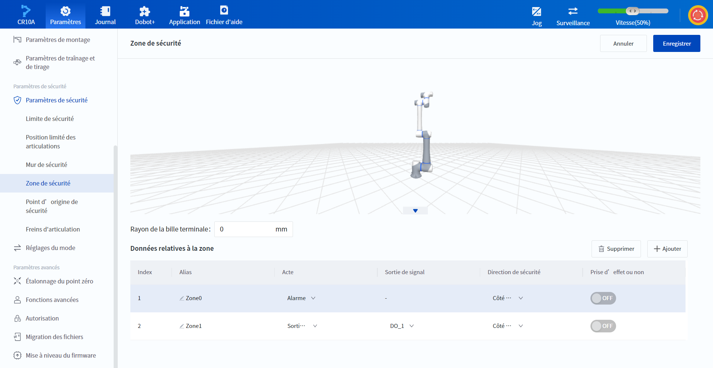
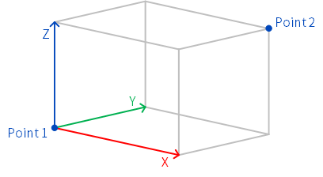
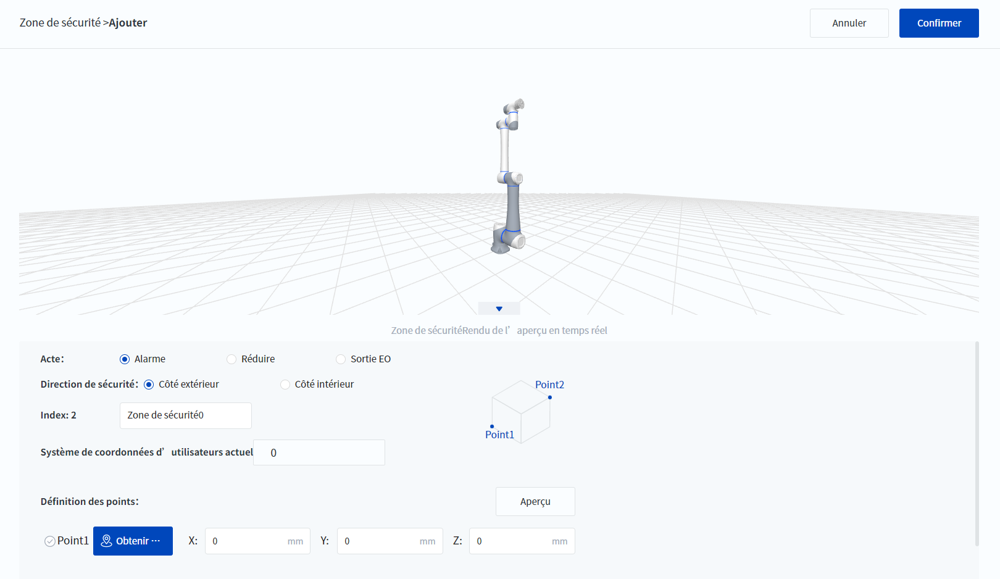
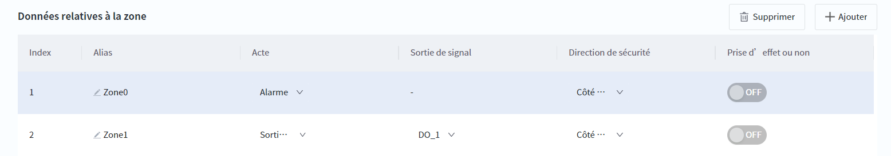
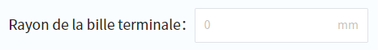

# 10.13.5 Zone de sécurité

DobotStudio Pro permet de définir jusqu'à 6 zones de sécurité, l'intérieur ou l'extérieur de la zone spécifiée étant la zone de sécurité du robot. Lorsque la boule du robot **et de l'outil (un espace sphérique avec un rayon personnalisé centré sur le TCP)** s'approche ou dépasse une zone de sécurité, différents types d'actions sont déclenchés en fonction du type de comportement dans la zone de sécurité.

- **Alarme** : à l'approche de la limite de sécurité, une alarme est déclenchée et le mouvement est arrêté si la poursuite de la planification actuelle du mouvement amène le robot à dépasser la zone de sécurité. 
- **Réduire** : lorsque l'espace de sécurité est dépassé, le robot déclenche le mode de réduction pour ralentir. 
- **Sortie EO** : Lorsque l'espace de sécurité est dépassé, le robot déclenche la sortie spécifiée, ce qui n'affecte pas le mouvement. 

Plusieurs zones ou murs de sécurité sont effectifs en même temps, et le même DO peut être défini. Le déclenchement de l'une des zones ou murs de sécurité effectifs déclenchera l'action correspondante.

### Ajouter une zone de sécurité

Cliquez sur  **Ajouter** pour ajouter une zone de sécurité La zone de sécurité est un cube, l'utilisateur doit apprendre les deux sommets (Point1 et Point2) de la diagonale de la zone de sécurité, puis déterminer la direction des arêtes du cube en spécifiant le système de coordonnées de l'utilisateur, comme le montre la figure suivante.

 

1. Tapez sur le robot ou faites-le glisser jusqu'au point 1 et cliquez sur  **Obtenir des points** pour obtenir les coordonnées du point 1.
2. Utilisez la même méthode pour obtenir les coordonnées du point 2.

3. Sélectionnez le **Système de coordonnées d’utilisateurs actuel** et cliquez sur **Aperçu** pour voir la zone de sécurité générée dans la zone de simulation supérieure.
  
   
<b> Description : </b>

   <ul><li>L’utilisateur peut également saisir ou modifier manuellement les coordonnées cartésiennes des points. </li>
   <li>Après avoir modifié les paramètres, cliquez sur <b>Aperçu</b> pour mettre à jour l’affichage dans la zone de simulation. </li>
   </ul>

4. Définissez le comportement de la boule de l'outil final du robot lorsqu'elle sort de la zone de sécurité.

5. Définir la direction de sécurité **Côté extérieur** signifie que toutes les zones situées à l'extérieur du cube sont des zones de sécurité, et **Côté intérieur** signifie que l'intérieur du cube est une zone de sécurité.

6. Cliquez sur **confirmer**, ajouter une zone de sécurité.

### Modifier une zone de sécurité

 

Les propriétés des zones de sécurité peuvent être modifiées, à l'exception de l'**Index** et de la **Forme de la zone**, où la **Sortie de signal** n'est configurable que pour les zones de sécurité dont le **Comportement** est la **Sortie EO**. L'interrupteur situé à droite permet de déterminer si la zone de sécurité est active ou inactive (elle ne peut être utilisée que dans l'état activé sous le robot). Seules les zones de sécurité actives interfèrent avec le robot et s'affichent dans la zone de simulation.

Cliquez sur  **Supprimer** après avoir sélectionné une zone de sécurité pour supprimer la zone de sécurité sélectionnée.

### Paramètres avancés

 

**Rayon de la bille terminale**

Spécifiez le rayon de la sphère de l'outil final (un espace sphérique avec un rayon personnalisé centré sur TCP) qui déclenche l'action de la zone sûre lorsqu'elle interfère avec des zones non sûres ; un paramètre de 0 signifie que seul TCP interfère avec les zones restreintes.