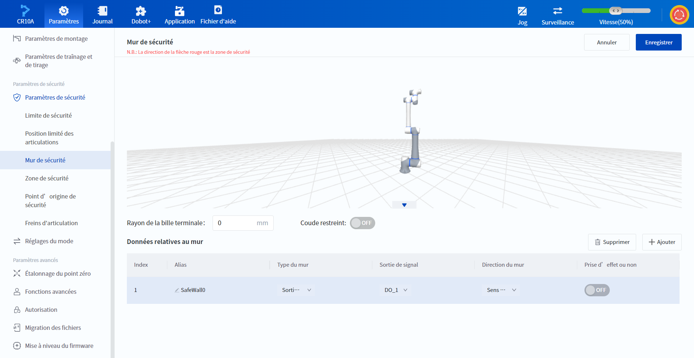
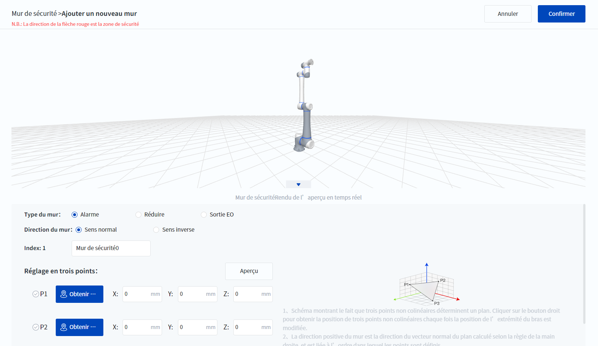
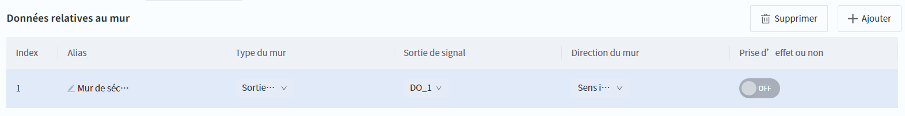
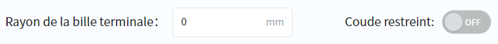

# 10.13.4 Mur de sécurité

DobotStudio Pro prend en charge la configuration d'un maximum de 8 murs de sécurité, qui désignent l'espace de sécurité du robot en fonction de l'orientation du mur. Lorsque la boule de l'outil final du robot (un espace sphérique avec un rayon personnalisé centré sur le TCP) ou l'articulation J3 (en option) approche ou dépasse l'espace de sécurité défini par le mur de sécurité, différents types de mouvement sont déclenchés en fonction du type de mur.

- **Alarme** : à l'approche de la limite de sécurité, une alarme est déclenchée et le mouvement est arrêté si la poursuite de la planification actuelle du mouvement amène le robot à dépasser la zone de sécurité. 
- **Réduire** : lorsque l'espace de sécurité est dépassé, le robot déclenche le mode de réduction pour ralentir. 
- **Sortie EO** : Lorsque l'espace de sécurité est dépassé, le robot déclenche la sortie spécifiée, ce qui n'affecte pas le mouvement. 

Différents murs ou zones de sécurité sont effectifs en même temps et le même DO peut être défini. Le déclenchement de l'un des murs ou zones de sécurité effectifs déclenchera l'action correspondante.

 

### Ajouter un mur de sécurité

Cliquez sur  **Ajouter** pour ajouter un nouveau mur de sécurité. Un mur de sécurité est un plan défini par l'utilisateur qui peut être déterminé par trois points sur le plan qui ne partagent pas de ligne commune. L'utilisateur doit d'abord identifier ces trois points, ci-après dénommés P1, P2 et P3.

 

1. Tapez sur le robot ou faites-le glisser jusqu'à P1 et cliquez sur  **Obtenir des points** pour obtenir les coordonnées de P1.
2. Utilisez la même méthode pour obtenir les coordonnées de P2 et P3, puis cliquez sur **Aperçu** pour voir le mur de sécurité généré dans la zone de simulation ci-dessus.
  
   
<b> Description : </b>

   <ul><li>L’utilisateur peut également saisir ou modifier manuellement les coordonnées cartésiennes des points. </li>
   <li>Après avoir modifié les paramètres, cliquez sur <b>Aperçu</b> pour mettre à jour l’affichage dans la zone de simulation. </li>
   </ul>

3. Définir le Type du mur.

4. Définir la Direction du mur La direction du mur peut être visualisée dans la zone de simulation : la direction de la flèche correspond au côté sûr du mur et la direction opposée au côté restreint.
  
   
<b> Description : </b>
La direction positive du mur est déterminée par le sens du vecteur P1 -> P2 -> P3, et le vecteur normal au plan est calculé en utilisant la règle de la main droite. 

5. Cliquez sur **confirmer**, ajouter un mur de sécurité.

### Modifier un mur de sécurité

 

Les propriétés de la paroi peuvent être modifiées, à l'exception de l'**Index**, pour lequel la **Sortie de signal** ne peut être configurée que pour la **Sortie EO** du **Type de mur**. L'interrupteur situé sur le côté droit contrôle si le mur de sécurité est actif ou non (il ne peut être utilisé que dans l'état activé sous le robot), et seul le mur de sécurité actif interférera avec le bras du robot et s'affichera dans la zone de simulation.

Cliquez sur  **Supprimer** après avoir sélectionné un mur pour supprimer le mur sélectionné.

### Paramètres avancés

 

**Rayon de la bille terminale**

Spécifiez le rayon de la sphère de l'outil final (un espace sphérique avec un rayon personnalisé centré sur TCP) qui déclenchera l'action du mur de sécurité lorsqu'il interfère avec la zone restreinte du mur de sécurité ; un paramètre de 0 signifie que seul TCP interfère avec la zone restreinte.

**Coude restreint**

Lorsque cette option est réglée sur **ON**, cela signifie que le joint J3 interfère également avec la zone restreinte, et lorsqu'elle est réglée sur **OFF**, seule la bille de l'outil final interfère avec la zone restreinte.