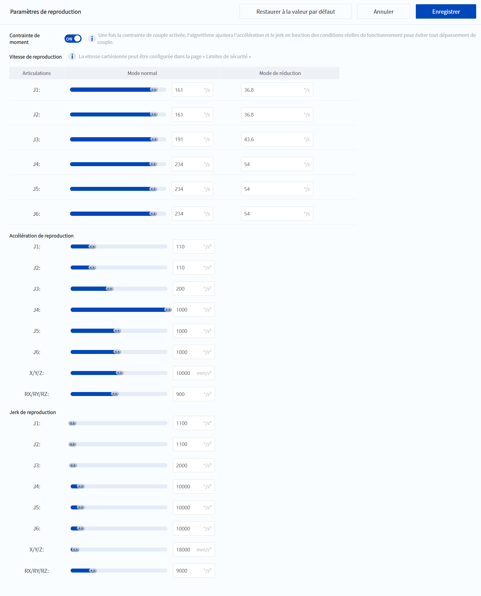
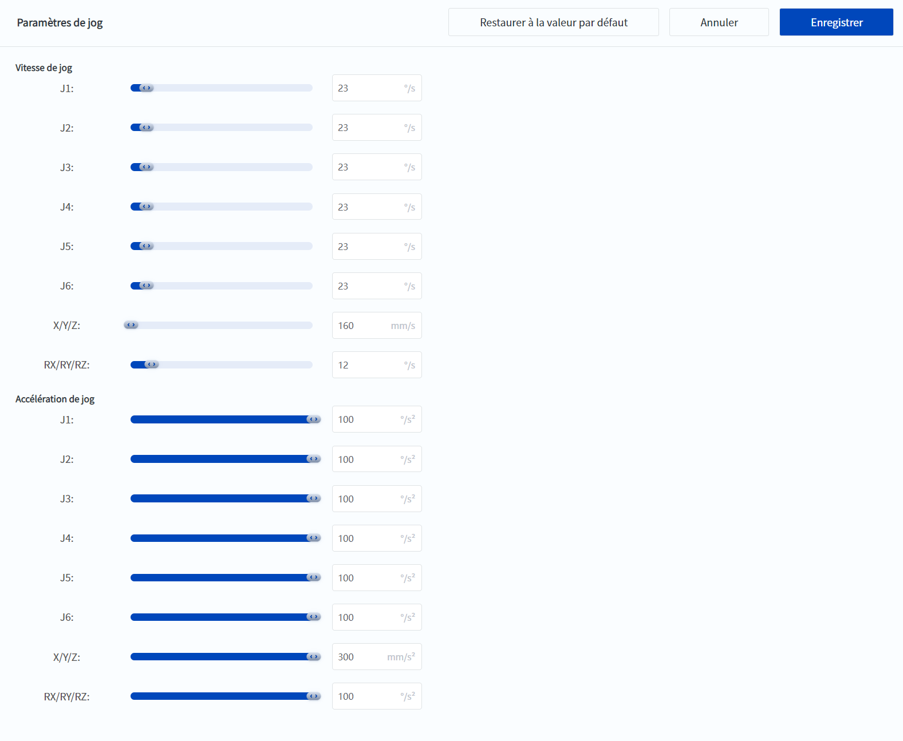

# 10.6 Paramètres de mouvement

Les paramètres de mouvement optimaux ont été définis pour des conditions de travail normales lorsque le robot est expédié de l'usine, et il n'est pas recommandé de les modifier s'il n'y a pas de besoin particulier. Si les utilisateurs estiment que la vitesse du robot est trop élevée, vous pouvez la réduire en fonction de vos besoins réels. Si vous avez besoin d'augmenter la vitesse, veuillez contacter le support technique pour consulter le programme d'augmentation de la vitesse.

Il existe une différence entre les pages de la série CRA et celles de Magician E6.

<h2 id="cra" class="m3">10.6.1 Paramètres de mouvement (CRA)</h2>

### Paramètres de reproduction

Les paramètres de reproduction sont les paramètres de mouvement lorsque le robot **Exécuter le projet** ou des **commandes de mouvement TCP_IP**.

 

**Contrainte de moment**

Cette fonction est très importante pour garantir un fonctionnement fiable du robot et il est recommandé de l'activer. Une fois la contrainte de couple activée, l'algorithme ajustera l'accélération et le jerk en fonction des conditions réelles de fonctionnement pour éviter tout dépassement de couple.

**Vitesse de reproduction**

Définissez la vitesse maximale de chaque articulation du robot lors de la reproduction du mouvement, et vous devez définir la vitesse maximale en mode normal et en mode réduit respectivement. La vitesse maximale en mode réduit ne peut pas être supérieure à la vitesse maximale en mode normal.

Seules les vitesses des articulations peuvent être définies sur cette page. La vitesse maximale du TCP dans le système de coordonnées cartésiennes doit être définie sur la page **Limite de sécurité**.

**Accélération de reproduction/Jerk de reproduction**

Pour définir les valeurs maximales de l'accélération et du jerk pour le mouvement de reproduction, vous devez définir les valeurs pour le mouvement des articulations et le mouvement cartésien séparément.

### Paramètres de jog

 

Le paramètre de mouvement de point est le paramètre de mouvement pour le **jog/inching** du robot et le **mouvement dans le temps**.

**Vitesse de jog**

Pour définir la vitesse maximale du mouvement de pointage, définissez séparément la vitesse de l'articulation et la vitesse cartésienne.

**Accélération de jog**

Pour définir l'accélération maximale du mouvement de pointage, définissez l'accélération de l'articulation et l'accélération cartésienne.

### Facteurs influençant le rythme

- En pratique, la vitesse maximale du robot est déterminée par la vitesse maximale de l'articulation et la vitesse maximale du TCP. La vitesse maximale de l'articulation peut être définie via l'interface des **paramètres de mouvement**, tandis que la vitesse maximale du TCP est affectée par les **[Limite de sécurité](safelimit.md)** (par exemple, la vitesse du TCP, l'élan, le temps d'arrêt, la distance d'arrêt). 
- L'accélération maximale et l'accélération du robot ne sont pas seulement affectées par les paramètres de mouvement du point, mais dépendent également de l'activation ou non de la fonction de **contrainte de moment**, ce qui garantit la sécurité et la stabilité du robot pendant le fonctionnement.

<h2 id="e6" class="m3">10.6.2 Paramètres de mouvement (Magician E6)</h2>

 

La **Configuration du démonstrateur** est le paramètre de mouvement du robot pour le **jog/inching** et le déplacement du  **vers**, et prennent en charge le réglage de la vitesse et de l'accélération maximales pour chaque articulation ou système de coordonnées cartésiennes.

Les **paramètres de reproduction** sont les paramètres de mouvement lorsque le robot **Exécuter le projet** ou des **commandes de mouvement TCP_IP**. Ils permettent de définir la vitesse maximale, l'accélération maximale et l'accélération maximale pour chaque articulation ou système de coordonnées cartésiennes.

Cliquez sur **Enregistrer** pour enregistrer les valeurs modifiées une fois la modification terminée, cliquez sur **Annuler** pour annuler cette modification et cliquez sur **Restaurer à la valeur par défaut** pour rétablir les valeurs par défaut des paramètres.