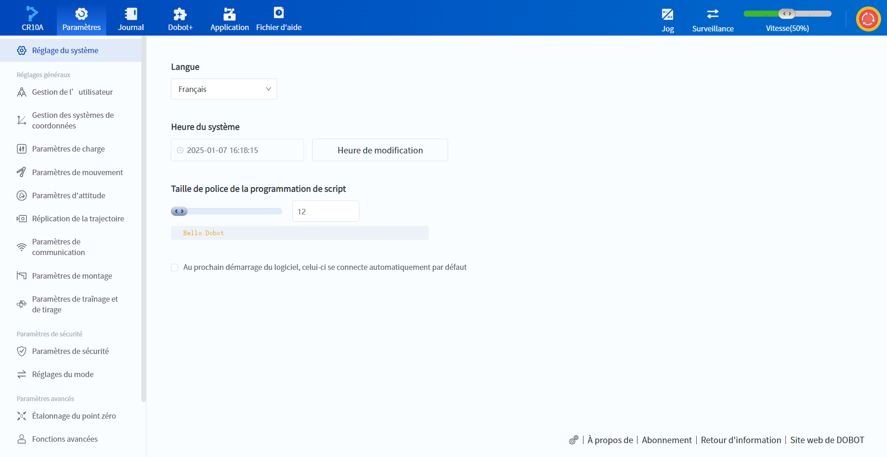
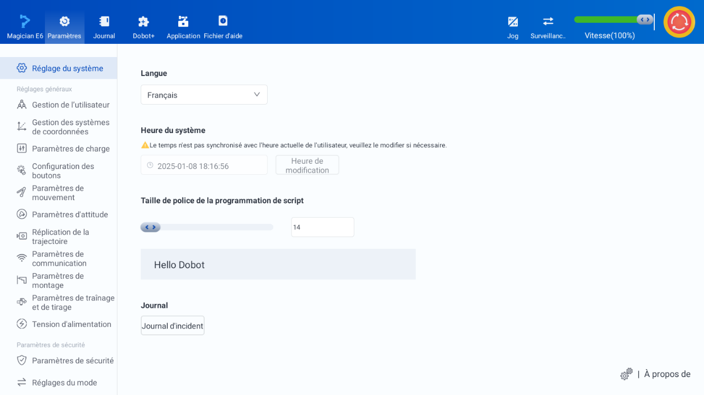

# 10.1 Réglage du système

La page Réglage du système permet de modifier la langue d'affichage de l'interface logicielle, l'heure du système, la taille de la police de programmation des scripts, etc.

**PC**

 

**Terminal mobile**

 

**Langue** : définit la langue d'affichage de l'interface du DobotStudio Pro. Elle peut également être modifiée lorsque le robot n'est pas connecté.

<b> Description : </b>
Si vous ne parvenez pas à configurer la langue souhaitée, veuillez contacter le support technique. 

 

**Heure du système** : affiche l'heure système actuelle du contrôleur, qui peut être modifiée lorsque le projet n'est pas exécuté en[ mode par défaut ou en mode manuel](..\operation\ma_mode.md). Si l'heure système de l'appareil actuel ne correspond pas à l'heure système du contrôleur, une invite s'affiche sur l'interface et il est recommandé de la modifier pour qu'elle corresponde à l'heure système.

**Taille de police de la programmation de script** : Définit la taille de la police de la zone de code de [programmation de script](../programming/script.md), la valeur par défaut est 14, la plage de valeurs est [12, 50].

**Journal** : Fonction mobile permettant de télécharger le journal des collisions. Nécessite une connexion Internet, peut fonctionner lorsque le robot n'est pas connecté.

**Au prochain démarrage du logiciel, celui-ci se connecte automatiquement par défaut** : si cette option est cochée, le système essaiera d'auto-connecter le bras du robot actuellement connecté au prochain démarrage du logiciel. Pris en charge sur PC uniquement.

L'icône et le texte dans le coin inférieur droit de l'interface peuvent être cliqués avec les fonctions suivantes :

 : Pour utiliser la fonction fabricant, vous devez entrer le mot de passe du fabricant, veuillez l'utiliser sous la direction du support technique.

**À propos** : Voir les composants de DobotStudio Pro du logiciel et l'avis de non-responsabilité au démarrage.

Les fonctions suivantes ne sont prises en charge que sur PC.

**Abonnement** : Obtenir les dernières nouvelles sur les mises à jour du logiciel et les actualités des produits...

**Retour d'information** : Faites-nous part de vos commentaires sur l'utilisation du logiciel.

**Site web de DOBOT** : Cliquez sur ce bouton pour ouvrir le navigateur et visiter le [site officiel de DOBOT](https://www.dobot-robots.com).