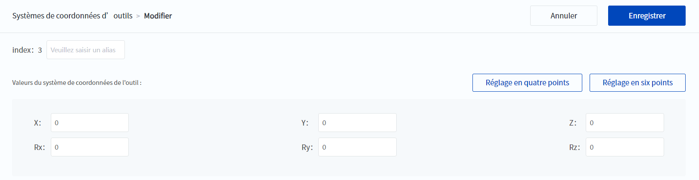

# 10.3.2 Systèmes de coordonnées d'outils

Lorsqu'un outil (par exemple, une torche, une buse, une fixation, etc.) est monté à l'extrémité du bras robotisé, il est nécessaire de mettre en place un système de coordonnées d'outils pour la programmation et le fonctionnement du bras robotisé. Par exemple, si plusieurs dispositifs sont utilisés pour manipuler plusieurs pièces en même temps, chaque dispositif peut être configuré comme un système de coordonnées d'outil distinct afin d'améliorer l'efficacité de la manipulation.

Le système actuel prend en charge jusqu'à 51 systèmes de coordonnées d'outil [0, 50], le système de coordonnées d'outil **0** étant le système de coordonnées de la bride (voir le manuel du matériel de chaque robot), c'est-à-dire qu'aucun outil ne peut être modifié.

Le système de coordonnées d'outils est un système de coordonnées établi avec le TCP (Tool Centre Point, généralement défini comme le point d'action d'outils, par exemple le centre d'une ventouse, l'extrémité d'un pistolet de soudage) comme origine, qui est utilisé pour représenter la position et l'attitude d'outils. La valeur du système de coordonnées d'outils indique le décalage et l'angle de rotation du système de coordonnées d'outils par rapport au système de coordonnées d'outils 0.

<b> Attention : </b>
Lors de l’établissement d’un système de coordonnées d’outils, assurez-vous que le système de coordonnées de référence lors de la capture des points est le système de coordonnées d’outils<b>0</b>. 

 

Il est recommandé de générer le système de coordonnées d'outils à six axes par la méthode d'apprentissage à six points "TCP+ZX" : après avoir installé l'outil à l'extrémité du bras robotique, réglez l'attitude de l'outil, de sorte que le TCP soit aligné avec le même point (point de référence) dans l'espace dans trois directions différentes (①, ②, ③) pour obtenir le décalage de la position de l'outil. Obtenez ensuite le décalage de l'attitude de l'outil en fonction des trois autres points (④ ⑤ ⑥), où ④ et ① ② ③ sont alignés sur le même point.

### Créer le système de coordonnées d'outils

1. Cliquez sur  **Ajouter** dans la page Systèmes de coordonnées d’outils, comme le montre la figure suivante.
  
   

2. Dans la page Ajouter un système de coordonnées d’outils, cliquez sur **Réglage en six points** à droite de la valeur du système de coordonnées.
  
   

   
   
<b> Description : </b>
L’utilisateur peut modifier directement les valeurs de X, Y, Z, Rx, Ry, Rz, puis cliquer sur <b>Enregistrer</b>. La méthode d’opération de <b>Réglage en quatre points</b> est similaire à celle de <b>Réglage en six points</b>, et les détails ne sont pas répétés dans cet article. 

3. En vous référant au diagramme, commandez le bras du robot pour qu'il se déplace jusqu'au point correspondant et cliquez sur  **Obtenir des points**.
  
   

   
   
<b> Description : </b>
Appuyez longuement sur  <b>Mouvement vers</b> pour faire se déplacer le bras robotique vers les points obtenus. 

4. Cliquez sur **Confirmer** pour revenir à la page Ajouter un système de coordonnées d'outil, la valeur du système de coordonnées sera mise à jour à la valeur calibrée, vous pouvez visualiser/modifier le réglage des trois points du système de coordonnées généré ou modifier la valeur du système de coordonnées manuellement, veuillez vous référer aux étapes suivantes pour modifier le système de coordonnées d'outils.

5. Cliquez sur **Enregistrer** pour ajouter ce système de coordonnées à la liste Système de coordonnées d'outils.

### Modifier le système de coordonnées d'outils

1. Sur la page Système de coordonnées d'outils, sélectionnez le système de coordonnées et cliquez sur  **Modifier**, comme le montre la figure suivante.
  
   

2. Si la valeur du système de coordonnées d'outils sélectionné est la valeur enregistrée après la saisie manuelle, l'apparence de la page Modifier est la même que celle de la page Ajouter, et vous pouvez la modifier directement ou cliquer sur **Réglage en quatre points/Réglage en six points** pour l'étalonner. Si la valeur du système de coordonnées d'outils sélectionné est générée par le réglage quatre/six points, la page de modification se présente comme suit et le texte de la vue du **réglage en six points** change en fonction de la méthode de génération.
  
   

3. Cliquez sur **Visualiser les réglages en six points** pour afficher la configuration à six points qui a généré la valeur du système de coordonnées et la récupérer pour les points qui doivent être modifiés. Le même pour le Réglage en quatre points.

4. Cliquez sur **Modifier** pour modifier directement la valeur du système de coordonnées. Veuillez noter qu'après une modification manuelle, vous ne pouvez plus visualiser les paramètres à six/quatre points correspondant à la valeur du système de coordonnées avant la modification.

5. Cliquez sur **Enregistrer** pour mettre à jour ce système de coordonnées dans la liste des systèmes de coordonnées d'outils.

### Copier le système de coordonnées d'outils

Sélectionnez un système de coordonnées dans la page Systèmes de coordonnées de l'utilisateur et cliquez sur  **Copier** pour créer un nouveau système de coordonnées identique à celui sélectionné.

### Effacer le système de coordonnées d'outils

Vous pouvez effacer le système de coordonnées sélectionné en le sélectionnant dans la page Systèmes de coordonnées de l'utilisateur et en cliquant sur  **Vider** et confirmer. Le système de coordonnées effacé occupe toujours son identifiant, seules les données du système de coordonnées sont effacées (par exemple, le système de coordonnées 3 dans la figure suivante), et il signale une erreur lorsqu'il est appelé.

 

Vous pouvez masquer un système de coordonnées vide en cochant la case **Cacher le système de coordonnées vide**, puis le bouton devient **Afficher le système de coordonnées vide**, cliquez dessus pour restaurer le système de coordonnées vide.

 

Les systèmes de coordonnées vides peuvent être modifiés et seront réaffectés après modification.
