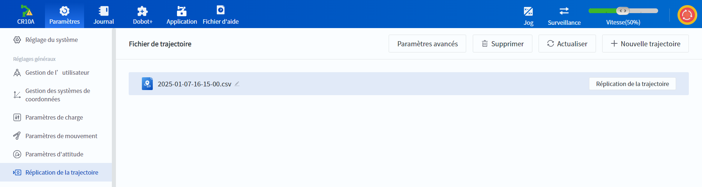
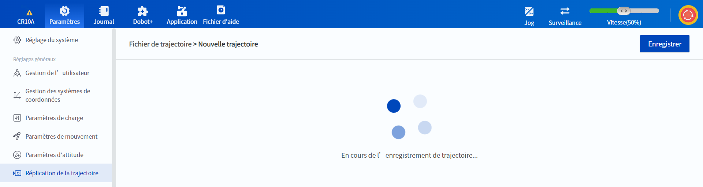
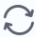
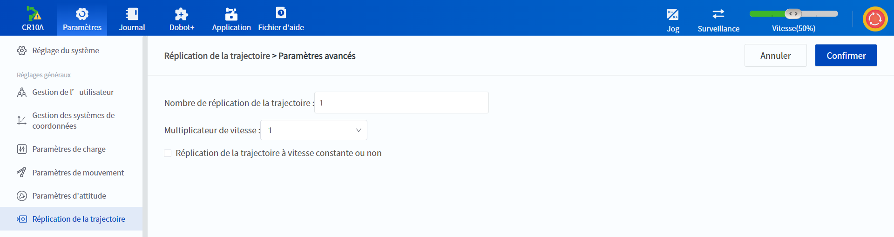

# 10.8 Réplication de la trajectoire

La reproduction de la trajectoire est utilisée pour enregistrer et reproduire la trajectoire de mouvement du bras du robot.

 

Après avoir cliqué sur  **Nouvelle trajectoire** dans le coin supérieur droit, le bras du robot entre en Mode « glisser-déposer, et l'utilisateur peut faire glisser le bras du robot à ce moment-là, et la trajectoire déplacée sera enregistrée. La trajectoire sera enregistrée toutes les 50 ms et le nombre maximum de points enregistrés dans une seule trajectoire est de 10 000 points (environ 500 secondes).

<b> Attention : </b>
Pendant l’enregistrement d’une trajectoire, veuillez ne pas changer le système de coordonnées d’utilisateurs ou d’outils, car sinon, la trajectoire enregistrée ne pourra pas être reproduite. 

 

 

Lorsque la trajectoire que vous souhaitez enregistrer est terminée, cliquez sur **Enregistrer**, le bras quittera le Mode « glisser-déposer et une nouvelle trajectoire sera ajoutée à la liste des fichiers de trajectoire.

- Vous pouvez modifier le nom du fichier de piste en cliquant  à côté du nom du fichier de piste.
- Cliquez sur **Réplication de la trajectoire** pour permettre au bras robotique de reproduire la trace enregistrée, et vous pouvez l'arrêter à tout moment pendant le processus de reproduction.
- Cliquez sur  **Supprimer** après avoir sélectionné un fichier de trace pour supprimer la trace.
- Cliquez sur  **Actualiser** pour obtenir la dernière liste des fichiers de trajectoire pour le contrôleur.

<b> Description : </b>
Les fichiers de trajectoire enregistrés peuvent également être appelés via l’instruction <a href="../blockly/move.md#track">Réplication de la trajectoire</a> dans la programmation graphique, ou via l’instruction <a href="../script/Motion.md#startpath">Réplication de la trajectoire</a> dans la programmation de script. 

 

Cliquez sur **Paramètres avancés** pour définir les paramètres de la méthode de reproduction des trajectoires. Les paramètres sont valables pour la reproduction des trajectoires initiée par l'interface DobotStudio Pro et les boutons situés à l'extrémité du bras du robot.

- Le **Nombre de réplication de la trajectoire** indique le nombre de fois que le robot répète une trajectoire après avoir cliqué sur **Réplication de la trajectoire**. Si le nombre de fois est supérieur à 1, le bras du robot reviendra automatiquement au point de départ de la trajectoire après avoir terminé une répétition de la trajectoire et commencera la répétition suivante.
- Le **Multiplicateur de vitesse** n'est effectif que lorsque la **Réplication de la trajectoire à vitesse constante ou non** est décochée, le bras robotique reproduira la trajectoire après une mise à l'échelle en fonction de la vitesse d'origine (non affectée par la vitesse globale).
- Si vous cochez l'option de **Réplication de la trajectoire à vitesse constante ou non**, le bras répétera la trajectoire en fonction de la vitesse globale à vitesse uniforme.

 

<b> Description : </b>
<ul>
    L’utilisateur peut également enregistrer une trajectoire en utilisant le bouton de l'effecteur terminal du robot (voir le manuel matériel correspondant pour plus de détails). Les différences entre l’enregistrement et la réplication de trajectoire via l’interface de DobotStudio Pro et le bouton de l'effecteur terminal du robot sont les suivantes :  <li>Les fichiers de trajectoire générés via l’interface de DobotStudio Pro portent le nom de la date et de l’heure d’enregistrement (année-mois-jour-heure-minute-seconde), et un nouveau fichier est créé à chaque enregistrement. Les fichiers de trajectoire générés via le bouton de l'effecteur terminal du robot portent le nom <i>TrackRecord.csv</i>, et chaque enregistrement écrase le fichier précédent. </li><li>Via l’interface de DobotStudio Pro, vous pouvez sélectionner la trajectoire à répéter, alors que via le bouton de l'effecteur terminal du robot, vous ne pouvez répéter que la trajectoire de <i>TrackRecord.csv</i>. </li>
    </ul>

