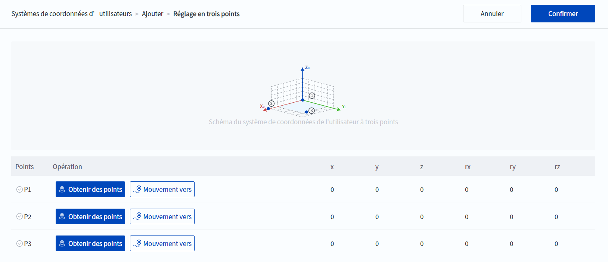

# 10.3.1 Systèmes de coordonnées d'utilisateurs

Lorsque la position de la pièce à usiner change ou que la procédure d'opération du bras du robot doit être réutilisée dans plusieurs systèmes d'usinage du même type, il est alors nécessaire de définir le système de coordonnées d'utilisateurs de sorte que toutes les trajectoires soient mises à jour de manière synchrone en suivant les coordonnées d'utilisateurs, ce qui simplifie grandement la programmation de l'enseignement de démonstration.

Le système actuel prend en charge jusqu'à 51 systèmes de coordonnées d'utilisateurs [0, 50], le système de coordonnées d'utilisateurs **0** étant le système de coordonnées de base (voir le manuel du matériel de chaque robot pour plus de détails), qui ne peut être modifié.

L'origine et la direction de chaque axe du système de coordonnées d'utilisateurs peuvent être personnalisées, et la même posture du robot aura des valeurs de coordonnées différentes selon les systèmes de coordonnées d'utilisateurs. La valeur du système de coordonnées d'utilisateurs indique le décalage et l'angle de rotation du système de coordonnées d'utilisateurs par rapport au système de coordonnées d'utilisateurs 0.

<b> Attention : </b>
Lors de l’établissement d’un système de coordonnées d’utilisateurs, assurez-vous que le système de coordonnées de référence lors de la capture des points est le système de coordonnées d’utilisateurs<b>0</b>. 

 

Il est recommandé de générer le système de coordonnées d'utilisateurs par la méthode d'apprentissage en trois points : le bras du robot est déplacé vers trois points **A**, **B** et **C**. Le point A est utilisé comme point d'origine et le point A comme angle de rotation. Le point **A** est utilisé comme origine, la ligne entre les deux points **AB** détermine la direction positive de l'axe X du système de coordonnées d'utilisateurs, la ligne verticale le long de l'axe X au point **C** détermine la direction positive de l'axe Y, et la direction de l'axe Z est déterminée selon la règle de la main droite.

### Créer le système de coordonnées d'utilisateurs

1. Cliquez sur  **Ajouter** dans la page Système de coordonnées d'utilisateurs, comme le montre la figure suivante.
  
   

2. Cliquez sur **Réglage en trois points** dans la page Ajouter un système de coordonnées d'utilisateurs.
  
   

   
   
<b> Description : </b>
L’utilisateur peut modifier directement les valeurs Cliquer, Y, Z, Rx, Ry, Rz, puis cliquer sur <b>Enregistrer</b>. X, Y et Z représentent la position de l’origine du système de coordonnées d’utilisateurs dans le système de coordonnées de base, tandis que Rx, Ry et Rz représentent les angles de rotation du système de coordonnées d’utilisateurs autour du système de coordonnées de base dans l’ordre X -> Y -> Z. 

3. En vous référant au diagramme, commandez le bras du robot pour qu'il se déplace jusqu'au point correspondant et cliquez sur  **Obtenir des points**.
  
   

   
   
<b> Description : </b>
Appuyez longuement sur  <b>Mouvement vers</b> pour faire se déplacer le bras robotique vers les points obtenus. 

4. Cliquez sur **Confirmer** pour revenir à la page Ajouter un système de coordonnées utilisateur et la valeur du système de coordonnées est mise à jour avec la valeur calibrée. Vous pouvez afficher/modifier le réglage des trois points du système de coordonnées généré ou modifier manuellement la valeur du système de coordonnées, comme indiqué dans les étapes suivantes de modification du système de coordonnées utilisateur.

5. Cliquez sur **Enregistrer** pour ajouter ce système de coordonnées à la liste des systèmes de coordonnées utilisateur.

### Modifier le système de coordonnées d'utilisateurs

1. Sur la page Système de coordonnées d'utilisateurs, sélectionnez le système de coordonnées et cliquez sur  **Modifier**, comme le montre la figure suivante.
  
    

 

2. Si la valeur du système de coordonnées d'utilisateurs sélectionné est la valeur enregistrée après saisie manuelle, l'apparence de la page Modifier est la même que celle de la page Ajouter, et vous pouvez la modifier directement ou cliquer sur **Réglage en trois points** pour l'étalonner. Si la valeur du système de coordonnées d'utilisateurs sélectionné est générée par le réglage trois points, l'interface utilisateur de la page Modifier est la suivante.
  
    

3. Cliquez sur **Visualiser le réglage en trois points** en bas à droite de la valeur du système de coordonnées pour afficher les paramètres trois points qui ont généré la valeur du système de coordonnées, puis ré-acquérir les points qui doivent être modifiés.

4. Cliquez sur **Modifier** pour modifier directement la valeur du système de coordonnées.
  
    
<b> Description : </b>
Après une modification manuelle, il n’est plus possible de consulter les valeurs du système de coordonnées correspondant aux trois points avant la modification. 

5. Cliquez sur **Enregistrer** pour mettre à jour ce système de coordonnées dans la liste des systèmes de coordonnées d'utilisateurs.

### Copier le système de coordonnées d'utilisateurs

Sélectionnez un système de coordonnées dans la page Systèmes de coordonnées d'utilisateurs et cliquez sur  **Copier** pour créer un nouveau système de coordonnées identique à celui sélectionné.

 

### Effacer le système de coordonnées d'utilisateurs

Vous pouvez effacer le système de coordonnées sélectionné en le sélectionnant dans la page Systèmes de coordonnées d'utilisateurs et en cliquant sur  **Vider** et confirmer. Le système de coordonnées effacé occupe toujours son identifiant, seules les données du système de coordonnées sont effacées (par exemple, le système de coordonnées 2 dans la figure suivante), et il signale une erreur lorsqu'il est appelé.

 

Cliquez sur **Cacher le système de coordonnées vide** pour masquer le système de coordonnées effacé de la liste des systèmes de coordonnées, puis le bouton devient **Afficher le système de coordonnées vide**, cliquez pour restaurer le système de coordonnées vide.

 

Les systèmes de coordonnées vides peuvent être modifiés et seront réaffectés après modification.
