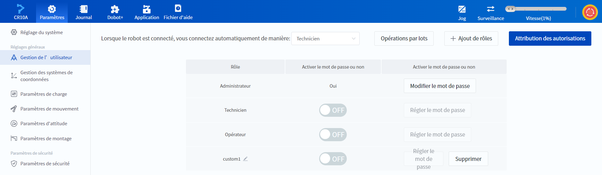

# 10.2 Gestion de l’utilisateur

Lorsqu'un utilisateur est connecté en tant qu'administrateur, il peut gérer les autorisations et les mots de passe des fonctions, etc. sur cette page, et prendre en charge l'ajout ou la suppression de fonctions personnalisées.

### Configurer des fonctions par défaut

Dans le coin supérieur gauche de la page, vous pouvez définir la fonction par défaut (qui ne peut pas être définie en tant qu'administrateur), c'est-à-dire la fonction qui se connecte automatiquement à chaque fois que vous vous connectez au robot. Si le mot de passe est activé pour la fonction par défaut, vous devez saisir le mot de passe ou sélectionner une autre fonction pour vous connecter à chaque fois que vous vous connectez au robot avant de pouvoir effectuer d'autres opérations.

### Gestion des fonctions personnalisées

Cliquez sur  **Ajout de rôles** pour ajouter jusqu'à deux fonctions personnalisées.

Les fonctions personnalisées peuvent être renommées, supprimées et utilisées de la même manière que les fonctions par défaut (voir ci-dessous).

### Régler le MDP

Le mot de passe de la fonction n'a pas d'exigences en matière de complexité et de longueur, il prend en charge la combinaison de lettres anglaises et de chiffres avec un maximum de 20 chiffres, veuillez le définir en fonction de vos besoins réels.

Le mot de passe de l'administrateur doit être activé, **le mot de passe par défaut est 888888**, la modification est autorisée, vous devez entrer l'ancien mot de passe lors de la modification.

 

Les autres fonctions n'activent pas le mot de passe par défaut, le commutateur **Activer le mot de passe ou non** est **OFF** par défaut. Cliquez sur le commutateur, le logiciel fait apparaître la fenêtre Définir le mot de passe, activez le mot de passe et le commutateur devient **ON**.

 

Après avoir défini le mot de passe, cliquez à nouveau sur **Régler le mot de passe** pour faire apparaître la même fenêtre Définir le mot de passe, et vous pouvez réinitialiser le mot de passe de la fonction correspondante en saisissant directement le nouveau mot de passe sans l'ancien mot de passe.

Lorsque vous désactivez le commutateur **Activer le mot de passe ou non**, le système efface le mot de passe actuel de la fonction correspondante et vous devez réinitialiser le mot de passe lors de la prochaine activation.

### Définition des privilèges fonctionnels

Cliquez sur **Attribution des autorisations** pour accéder à la page suivante (les fonctions personnalisées ne seront affichées qu'après avoir été ajoutées).

 

Vous pouvez modifier les privilèges de toutes les fonctions et cliquer sur **Réinitialisation des paramètres par défaut** pour rétablir la valeur par défaut de l'attribution des privilèges.

Cliquez sur **Enregistrer** pour que les paramètres prennent effet.

<h3 id="def_auth">Autorisations de fonction par défaut</h3>

Les autorisations de fonction par défaut sont indiquées dans le tableau suivant, dans lequel les autorisations **Ouvrir/Exécuter/Arrêter le projet** ne peuvent pas être modifiées.

<table>
 <colgroup>
    <col style="width: 15%">
    <col style="width: 40%">
    <col style="width: 15%">
    <col style="width: 15%">
    <col style="width: 15%">
  </colgroup>
<thead>
<tr>
<th>Catégorie</th>
<th>Fonction</th>
<th>Administrateur</th>
<th>Technicien</th>
<th>Opérateur</th>
</tr>
</thead>
<tbody><tr>
<td style="text-align:center" rowspan=11>Opération de base</td>
<td>Ouvrir/Exécuter/Arrêter le projet</td>
<td>√</td>
<td>√</td>
<td>√</td>
</tr>
<tr>
<td>Actionnement, suppression d’alarmes, commutation de mode manuel/automatique, régulation proportionnelle de vitesse</td>
<td>√</td>
<td>√</td>
<td>√</td>
</tr>
<tr>
<td>Jogging du robot</td>
<td>√</td>
<td>√</td>
<td>√</td>
</tr>
<tr>
<td>Consultation/Exportation du journal</td>
<td>√</td>
<td>√</td>
<td>√</td>
</tr>
<tr>
<td>Commutation de mode en ligne/TCP, activation/désactivation des configurations des E/S/Modbus</td>
<td>√</td>
<td>√</td>
<td>X</td>
</tr>
<tr>
<td>Configuration d’E/S (y compris l’E/S de sécurité)</td>
<td>√</td>
<td>√</td>
<td>X</td>
</tr>
<tr>
<td>Configuration de Modbus</td>
<td>√</td>
<td>√</td>
<td>X</td>
</tr>
<tr>
<td>Configuration des variables globales</td>
<td>√</td>
<td>√</td>
<td>X</td>
</tr>
<tr>
<td>Plugin DOBOT+, configuration des boutons au terminal</td>
<td>√</td>
<td>√</td>
<td>X</td>
</tr>
<tr>
<td>Gestion de projets et de programmes</td>
<td>√</td>
<td>√</td>
<td>X</td>
</tr>
<tr>
<td>Opérations pour les listes des points</td>
<td>√</td>
<td>√</td>
<td>X</td>
</tr>
<tr>
<td style="text-align:center" rowspan=7>Réglages généraux</td>
<td>Réglage de la date et de l’heure du système</td>
<td>√</td>
<td>X</td>
<td>X</td>
</tr>
<tr>
<td>Gestion des systèmes de coordonnées</td>
<td>√</td>
<td>√</td>
<td>X</td>
</tr>
<tr>
<td>Configuration des paramètres de charge</td>
<td>√</td>
<td>√</td>
<td>X</td>
</tr>
<tr>
<td>Configuration des boutons</td>
<td>√</td>
<td>√</td>
<td>X</td>
</tr>
<tr>
<td>Enregistrement et réplication des trajectoires</td>
<td>√</td>
<td>√</td>
<td>X</td>
</tr>
<tr>
<td>Paramètres de communication</td>
<td>√</td>
<td>√</td>
<td>X</td>
</tr>
<tr>
<td>Tension d'alimentation</td>
<td>√</td>
<td>√</td>
<td>X</td>
</tr>
<tr>
<td style="text-align:center" rowspan=8>Paramètres avancés</td>
<td>Paramètres de Package/remise à zéro</td>
<td>√</td>
<td>X</td>
<td>X</td>
</tr>
<tr>
<td>Configuration des paramètres de mouvement</td>
<td>√</td>
<td>X</td>
<td>X</td>
</tr>
<tr>
<td>Paramètres de l’angle d’installation</td>
<td>√</td>
<td>X</td>
<td>X</td>
</tr>
<tr>
<td>Paramètres de traînage et de tirage</td>
<td>√</td>
<td>X</td>
<td>X</td>
</tr>
<tr>
<td>Paramètres de sécurité</td>
<td>√</td>
<td>X</td>
<td>X</td>
</tr>
<tr>
<td>Paramètres de mode manuel/automatique</td>
<td>√</td>
<td>X</td>
<td>X</td>
</tr>
<tr>
<td>Étalonnage du point zéro</td>
<td>√</td>
<td>X</td>
<td>X</td>
</tr>
<tr>
<td>Paramètres des fonctionnalités avancées</td>
<td>√</td>
<td>X</td>
<td>X</td>
</tr>
</tbody></table>

### Opérations par lots

Cliquez sur **Opération par lots > Exporter la configuration** pour exporter la configuration actuelle des autorisations d'utilisateur vers un fichier, et cliquez sur **Opération par lots > Importer la configuration** pour importer la configuration des autorisations d'utilisateur à partir d'un fichier.

