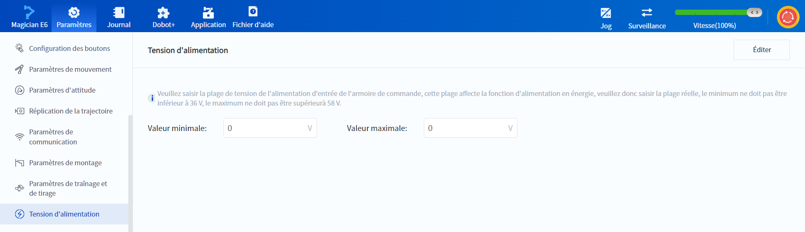

# 10.12 Tension d'alimentation (armoire de commande CC/Magician E6)

Lorsque le robot est connecté à une armoire de commande CC ou à Magician E6, la tension d'alimentation doit être définie dans le logiciel DobotStudio Pro. Cette plage de tension est liée à la fonction d'alimentation en énergie (utilisée pour libérer la force électromotrice générée par le robot lors de la décélération ou du freinage). Veuillez définir la plage de tension en fonction de la plage de tension réelle de l'alimentation électrique d'entrée, afin d'éviter la coupure de la protection contre la surtension ou l'endommagement de l'armoire de commande.

 

Cliquez sur **Paramètres** > **Tension d'alimentation** et entrez la plage de tension réelle de l'alimentation d'entrée.

- Lors de la connexion de la version CC262, la plage de valeurs est de 30~60V, et la valeur minimale ≤ valeur maximale.

- Lors de la connexion de Magician E6, la plage de valeurs est de 36~58V, et la valeur minimale≤maximale.