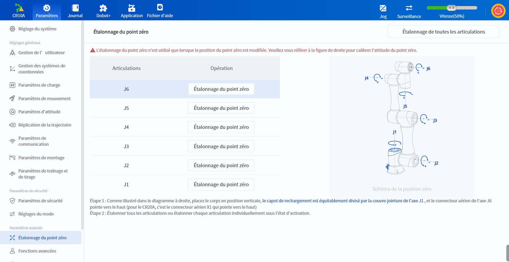
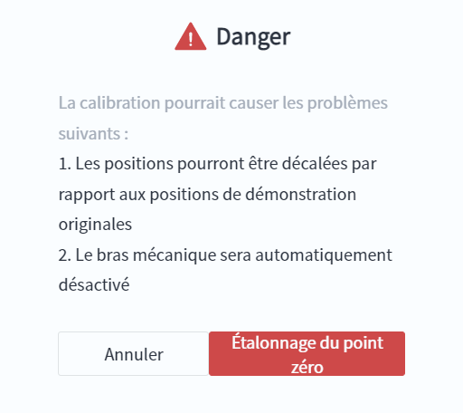

# 10.15 Étalonnage du point zéro

La position zéro du bras robotique change lors du remplacement du moteur, du réducteur et d'autres pièces de transmission du bras robotique ou lors d'une collision avec la pièce à usiner, etc.

 

Conformément aux invites de la page, déplacez d'abord le bras robotique jusqu'à l'attitude du point zéro (vous pouvez utiliser l'autocollant du point zéro de chaque articulation du bras robotique pour le calibrer, voir le manuel du matériel du bras robotique correspondant pour plus de détails).

Cliquez ensuite sur le bouton **Étalonnage de toutes les articulations** dans le coin supérieur droit de la page pour étalonner toutes les articulations dans l'état activé du robot, ou cliquez sur le bouton **Étalonnage du point zéro** correspondant à des articulations individuelles pour étalonner des articulations individuelles.

<b> Description : </b>
L'étalonnage du point zéro n'est utilisé que lorsque la position du point zéro est modifiée, veuillez opérer avec prudence. 

 

Une fois l'étalonnage réussi, vous devez activer le robot pour qu'il prenne effet. Vous pouvez alors vérifier les coordonnées des articulations dans le panneau de contrôle, à ce moment-là, les valeurs de J1~J6 sont toutes égales à 0.
